Langkah 1 : Pengecekan Lingkungan
---
<li> node -v & npm -v</li>
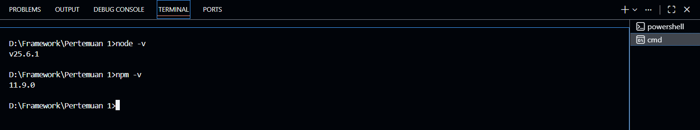
<li> git -v </li>
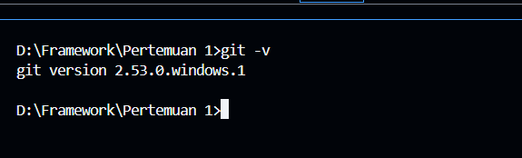

Langkah 2 – Membuat Project Next.js
---
<li> Buat direktori baru dan masuk ke direktori kerja </li>
<li>  Jalankan perintah </li>
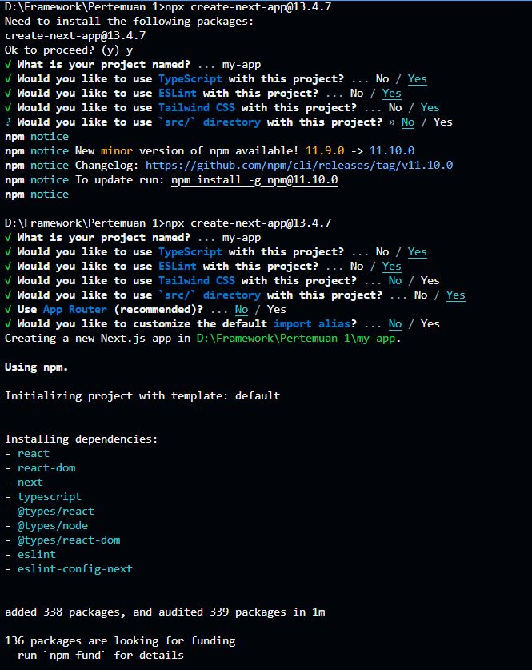
<li>Masuk ke folder projectnya </li>
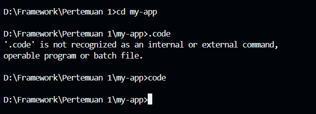

Langkah 3 – Menjalankan Server Development
---
<li> Masuk ke folder project: </li>
<li> Jalankan aplikasi: <b> npm run dev </b>
<li> Buka browser dan akses: http://localhost:3000
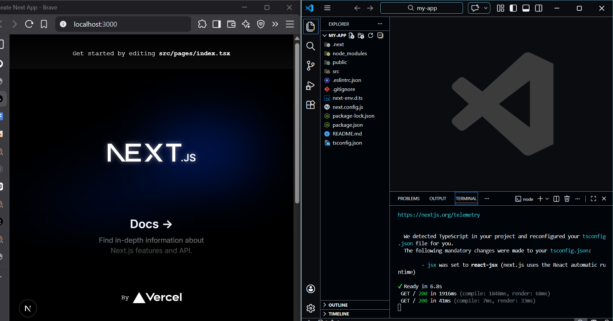

Langkah 4 – Mengenal Struktur Folder
---

Langkah 5 – Modifikasi Halaman Utama
---
<li> Ubah isi halaman pages/index.tsx 

```java
import Head from 'next/head'
import Image from 'next/image'
import { Inter } from 'next/font/google'
import styles from '@/styles/Home.module.css'
import Link from 'next/link'

const inter = Inter({ subsets: ['latin'] })
export default function Home() {
  return (
    <div>
       <h1>Praktikum Next.js Pages Router</h1> <br />
          <p>Mahasiswa D4 Pengembangan Web</p>
    </div>
```
<li> Jalankan di browser
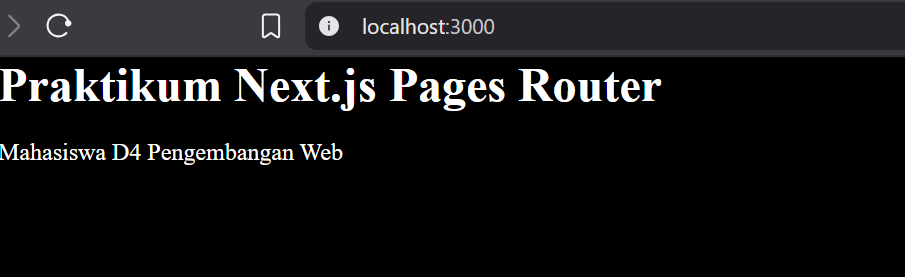


Langkah 6 - Modifikasi API
---
<li> Modifikasi hello.ts

```ts
// Next.js API route support: https://nextjs.org/docs/api-routes/introduction
import type { NextApiRequest, NextApiResponse } from 'next'

type Data = {
  name: string
  alamat: string
}

export default function handler(
  req: NextApiRequest,
  res: NextApiResponse<Data>
) {
  res.status(200).json({ name: 'John Doe', alamat: 'jl.suka suka no 1' })
}
```
<li> Jalankan browser dengan Alamat http://localhost:3000/api/hello
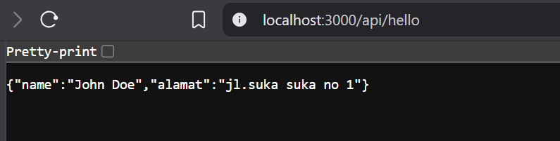

<li> Tambahkan extensions chrome
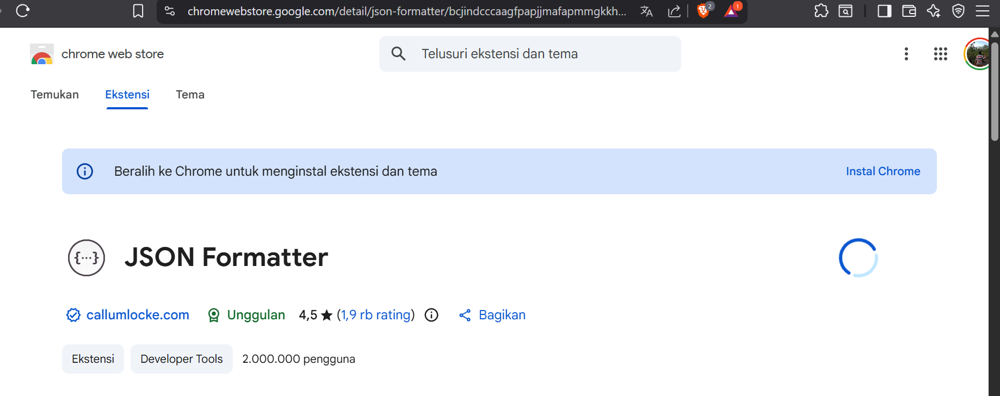
<li> Jalankan browser
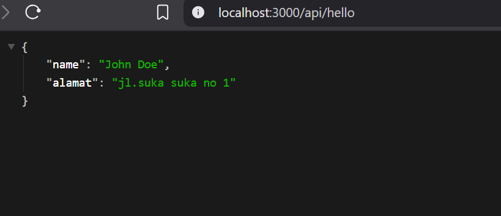

Langkah 7 - Modifikasi Background
---
<li> Modifikasi _app.tsx

```java
import '@/styles/globals.css'
import type { AppProps } from 'next/app'

export default function App({ Component, pageProps }: AppProps) {
  return <Component {...pageProps} />
}
```
<li> Jalankan :
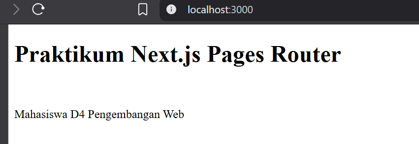

**TUGAS PRAKTIKUM**
---
<h3> Tugas 1 (Wajib) </h3>
Buat halaman baru about.js di folder pages dan tampilkan:
<li> Nama Mahasiswa
<li> NIM
<li> Program Studi</li>
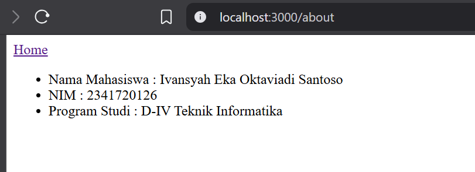

<h3> Tugas 2 (Pengayaan) </h3>

Tambahkan minimal 1 link navigasi dari halaman utama ke halaman about.
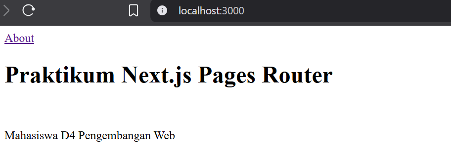

**Pertanyaan Refleksi**
---
1. Mengapa Pages Router disebut sebagai routing berbasis file?

Jawaban: Karena URL otomatis dibuat berdasarkan nama file di folder pages/. Jadi setiap file langsung menjadi route tanpa konfigurasi manual

2. Apa perbedaan Next.js dengan React standar (CRA)?

Jawaban: Next.js memiliki routing secara otomatis, bisa SSR/SSG, dan lebih SEO-friendly. Sedangkan CRA hanya SPA biasa dan perlu tambahan library untuk routing

3. Apa fungsi perintah npm run dev?

Jawaban: Untuk menjalankan project dalam mode development (coding) dengan hot reload di localhost

4. Apa perbedaan npm run dev dan run build ?

Jawaban: npm run dev untuk development atau menjalankan project sedangkan npm run build untuk membuat versi production yang sudah dioptimasi
