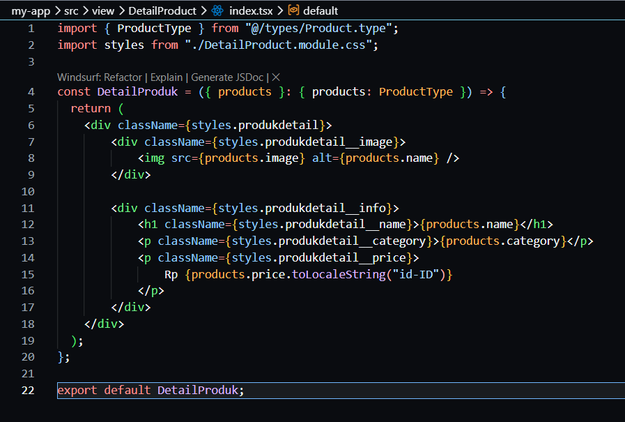
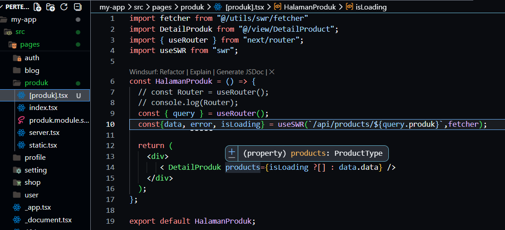
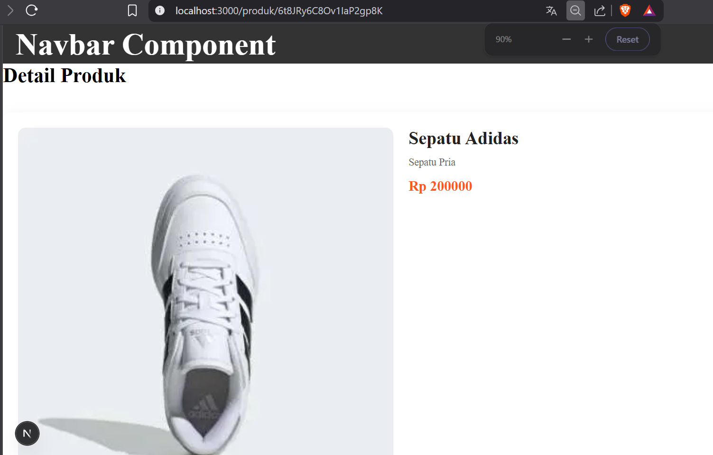
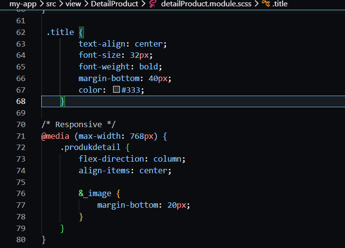
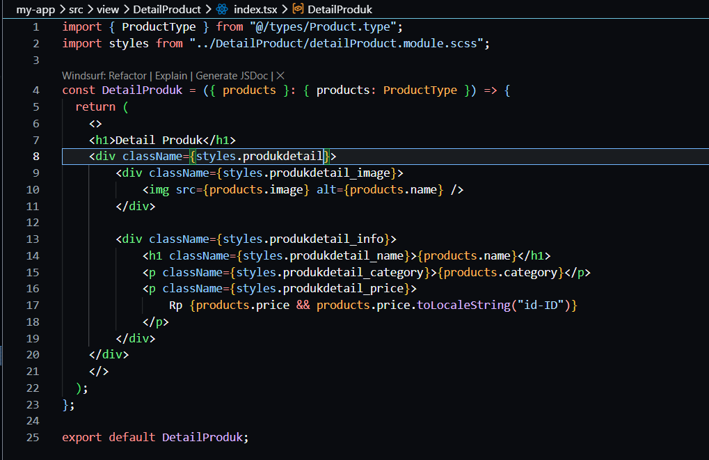
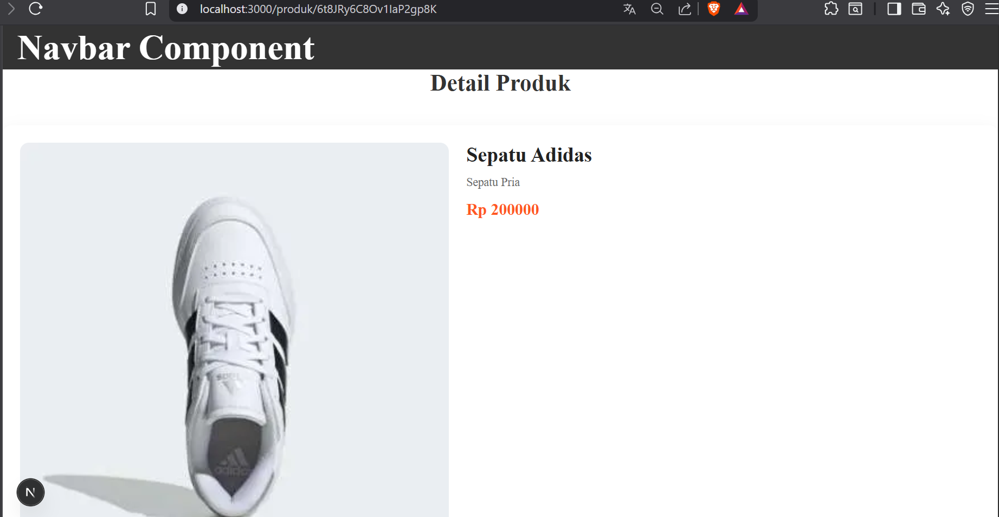
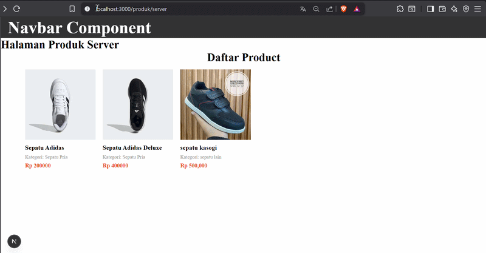

# Jobsheet 11 - Dynamic Routing

###  Langkah Praktikum

Bagian 1 - Membuat Dynamic Route
---

<li><h3>Buka file pages/products/[product].tsx dan modfikasi sbb ( line 20 )</h3></li>


<li><h3> Hasil jalankan browser http://localhost:3000/produk : </h3></li>


Bagian 2 - Implementasi CSR (Client Rendering)
---

<li><h3> Modifikasi pada file [produk].tsx pada folder src/pages/produk/ </h3></li>


<li><h3> Modifikasi file servicefirebase.ts</h3></li>


<li><h3> Pada file produk.ts pada folder pages/api di rename menjadi [[...product]].ts dan modifikasi isi kode pada file</h3></li>


<li><h3> Jalankan alamat url http://localhost:3000/api/produk/123 </h3></li>


<li><h3>Buat file dengan nama index.tsx pada folder views/DetailProduct selain itu buat juga
file dengan nama detailProduct.module.scss dan modifikasi filenya </h3></li>


<li><h3>Modifikasi index.tsx pada folder DetailProduct</h3></li>



<li><h3>Modifikasi file pada [product].tsx </h3></li>



<li><h3>Modifikasi index.tsx pada folder views/detailProduct line 16 </h3></li>


<li><h3> Hasil : </h3></li>



<h3><li>Agar tulisan detail produk ditengah maka modifikasi file detailProduct.module.scss line
103-108 dan file index.tsx tambahkan code pada line 7,8 dan 22 menjadi </h3></li>




<h3><li> Hasil : </h3></li>



Bagian 3 - Implementasi SSR
---

<li><h3> Modifikasi [produk].tsx pada folder src/pages/produk dan comment line 9 sampai 20
dikarena kita akan menggunakan metode SSR. Tambahkan beberapa kode untuk SSR </li>


<li><h3>Jalankan browser http://localhost:3000/produk/server </h3></li>



Bagian 4 – Implementasi Static Site Generation (Dynamic SSG)
---

<li><h3> Buka file [produk].tsx dan modifikasi seperti berikut </i></li>


<li><h3> Buka dan modifkasi file index.tsx pada folder pages/product/ </li>


<li><h3> Buat folder swr pada utils dan tambahkan file dengan nama fetcher.js </li>


<li><h3> Modifikasi file fetcher.ts </li>


### Tugas Praktikum

1. Jelaskan perbedaan: Client Side Rendering, Server Side Rendering dan Static Site Generation

Jawaban : CSR dilakukan di browser (client). Server hanya mengirim file dasar, lalu JavaScript yang membangun tampilan halaman. Lalu SSR dilakukan di server setiap ada permintaan. Server mengirim HTML yang sudah lengkap ke browser.Sedangkan SSG Halaman dibuat saat proses build dan disimpan sebagai file statis.

2. Buat halaman produk dengan: Skeleton loading dan Animasi

3. Refactor kode dari useEffect menjadi SWR.

```typescript
"use client";

import { useEffect, useState } from "react";
import TampilanProduct from "../views/product/index";
import useSWR from "swr";
import fetcher from "../utils/swr/fetcher";

const Product = () => {
  const { data, error, isLoading } = useSWR("/api/product", fetcher);

  return (
    <>
      <TampilanProduct products={isLoading ? [] : data.data} />
    </>
  );
};

export default Product;
```