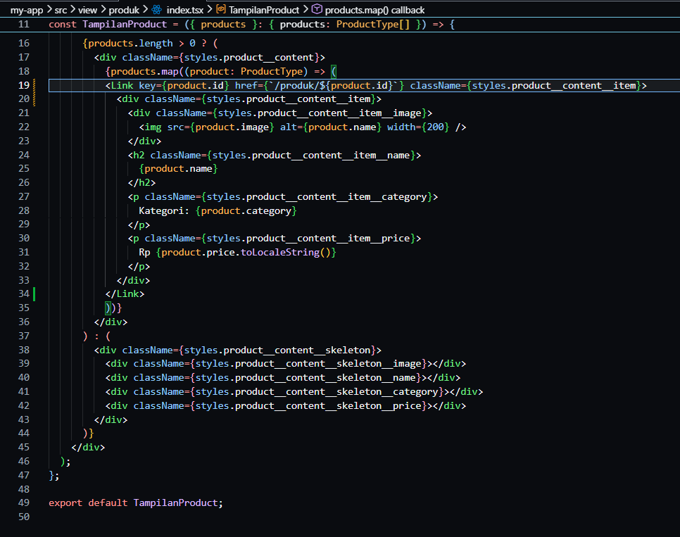
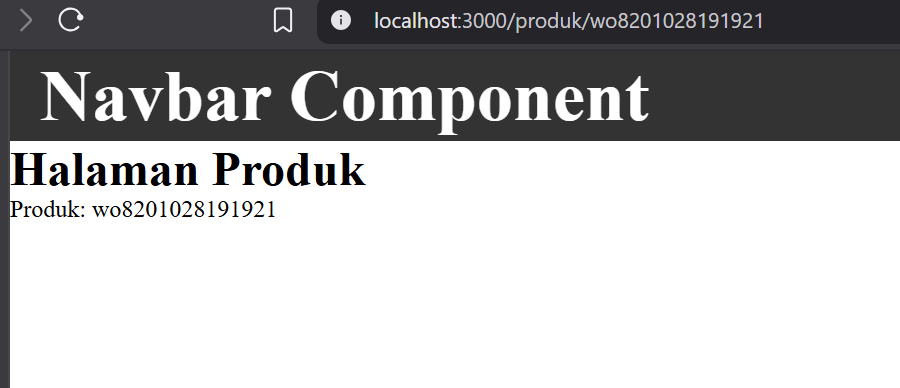
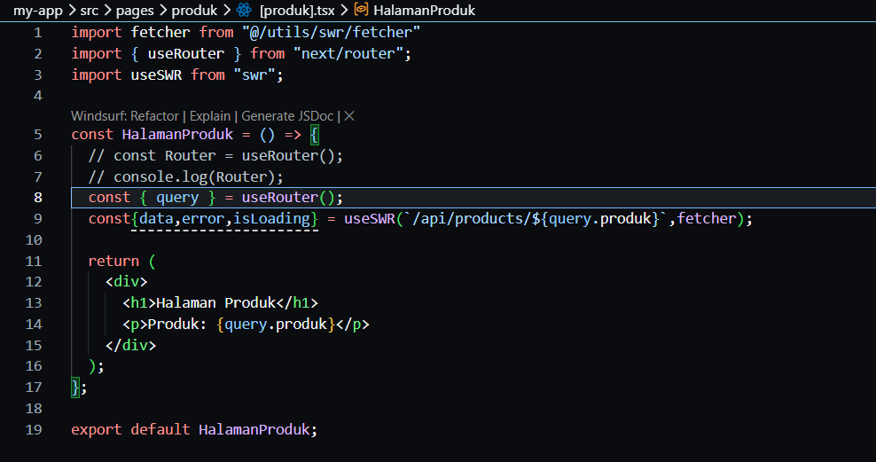
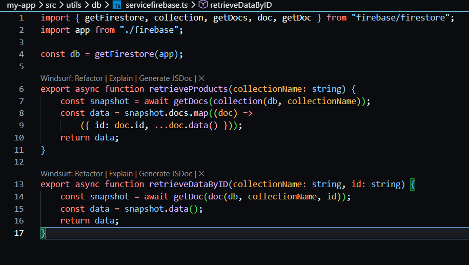
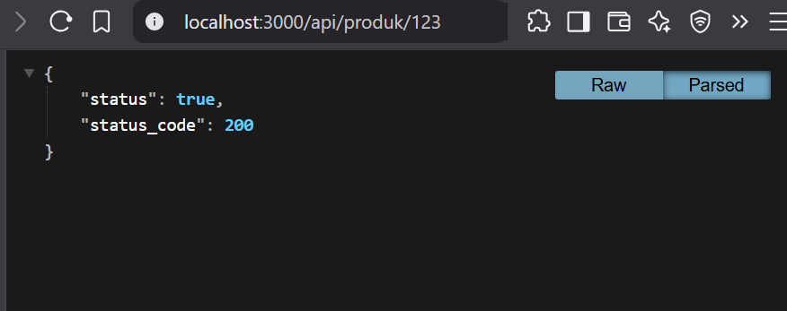
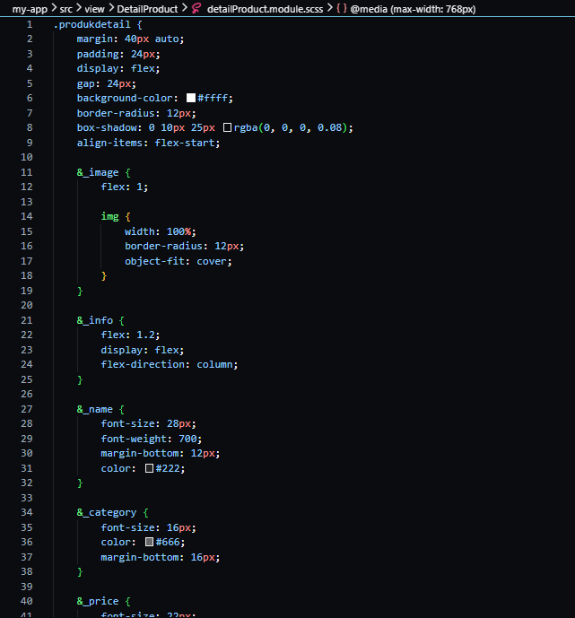
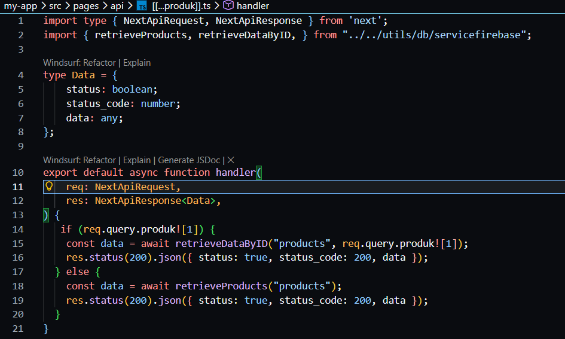
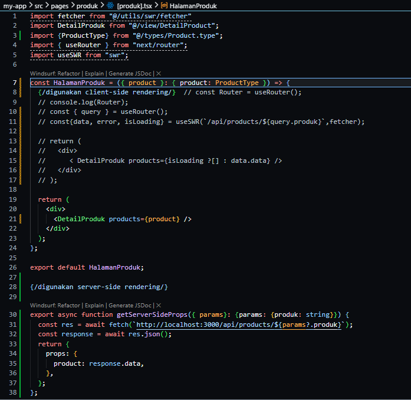
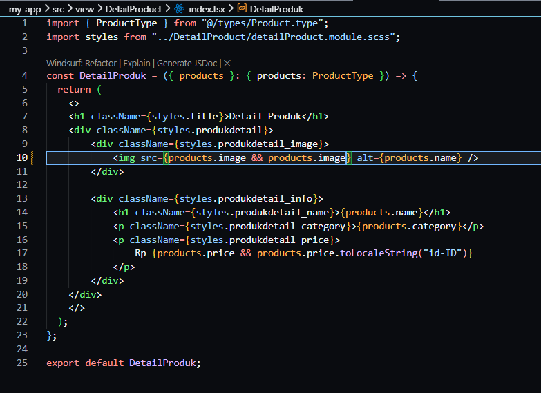
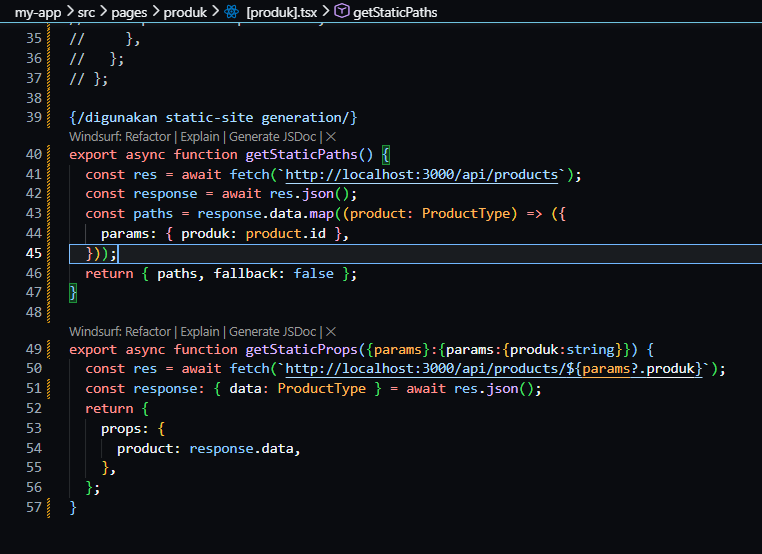

# Jobsheet 11 - Dynamic Routing

###  Langkah Praktikum

Bagian 1 - Membuat Dynamic Route
---

<li><h3>Buka file pages/products/[product].tsx dan modfikasi sbb ( line 20 )</h3></li>



<li><h3> Hasil jalankan browser http://localhost:3000/api/produk : </h3></li>



Langkah 2 - Implementasi CSR dengan useEffect
---

<li><h3> Buka file index.tsx pada folder views/products dan modfikasi kode index.tsx </h3></li>



<li><h3> Modifikasi index.tsx pada pages/produk/ </h3></li>



<li><h3> Hasil : </h3></li>



<li><h3>Modifikasi produk.modules.scss/</h3></li>




<li><h3>Modifikasi Pada file index.tsx pada folder pages/views/product</h3></li>



<li><h3> Hasil : </h3></li>


Langkah 3 - Implementasi Skeleton Loading
---

<li><h3> Modfikasi file index.tsx pada folder views/product/index.tsx </li>


<li><h3> Modifikasi file product.module.scss </li>



<li><h3> Hasil Jalankan browser maka akan muncul skeleton yang terdapat animasi berkedip : </h3></li>


<li><h3> Modifikasi pada index.tsx pada folder views/product/index.tsx </li>


<li><h3> Hasil : </h3></li>


Langkah 4 - Implementasi SWR
---

<li><h3> Install SWR menggunakan perintah <i>npm install swr</i></li>



<li><h3> Buka dan modifkasi file index.tsx pada folder pages/product/ </li>



<li><h3> Buat folder swr pada utils dan tambahkan file dengan nama fetcher.js </li>


<li><h3> Modifikasi file fetcher.ts </li>


### Tugas Praktikum

1. Jelaskan perbedaan: Client Side Rendering, Server Side Rendering dan Static Site Generation

Jawaban : CSR dilakukan di browser (client). Server hanya mengirim file dasar, lalu JavaScript yang membangun tampilan halaman. Lalu SSR dilakukan di server setiap ada permintaan. Server mengirim HTML yang sudah lengkap ke browser.Sedangkan SSG Halaman dibuat saat proses build dan disimpan sebagai file statis.

2. Buat halaman produk dengan: Skeleton loading dan Animasi

3. Refactor kode dari useEffect menjadi SWR.

```typescript
"use client";

import { useEffect, useState } from "react";
import TampilanProduct from "../views/product/index";
import useSWR from "swr";
import fetcher from "../utils/swr/fetcher";

const Product = () => {
  const { data, error, isLoading } = useSWR("/api/product", fetcher);

  return (
    <>
      <TampilanProduct products={isLoading ? [] : data.data} />
    </>
  );
};

export default Product;
```