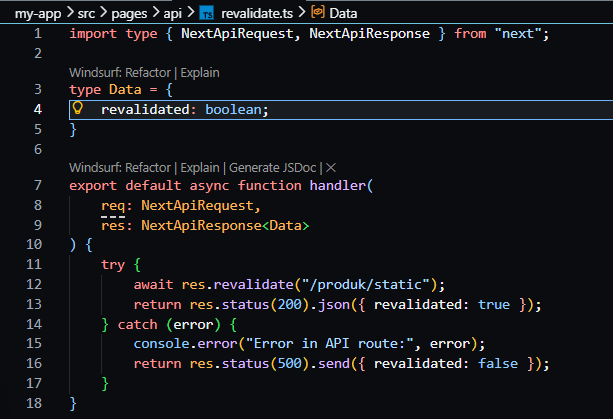
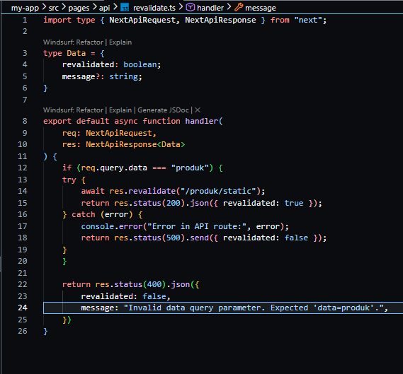
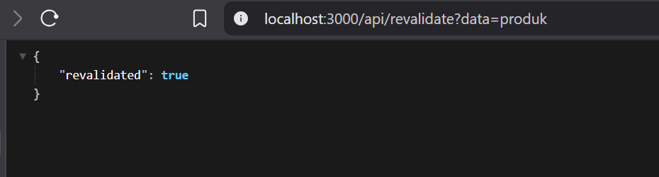
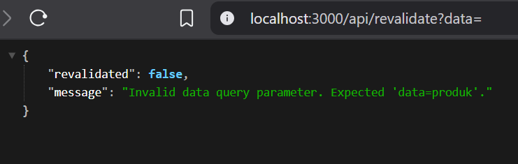
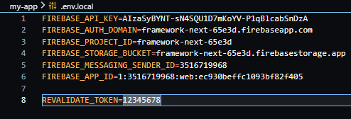
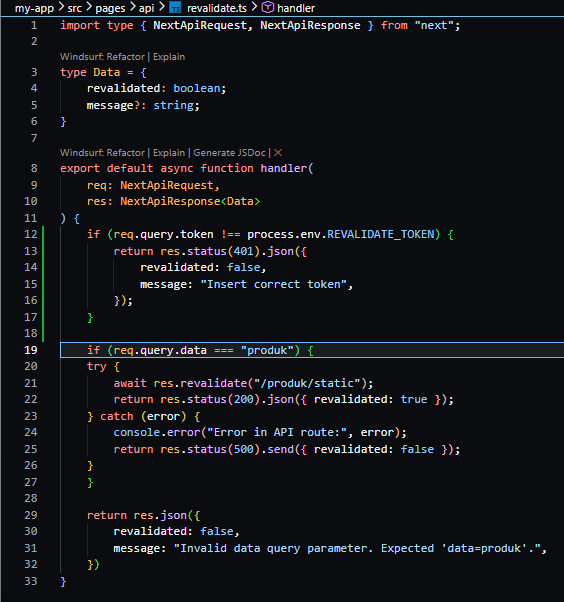
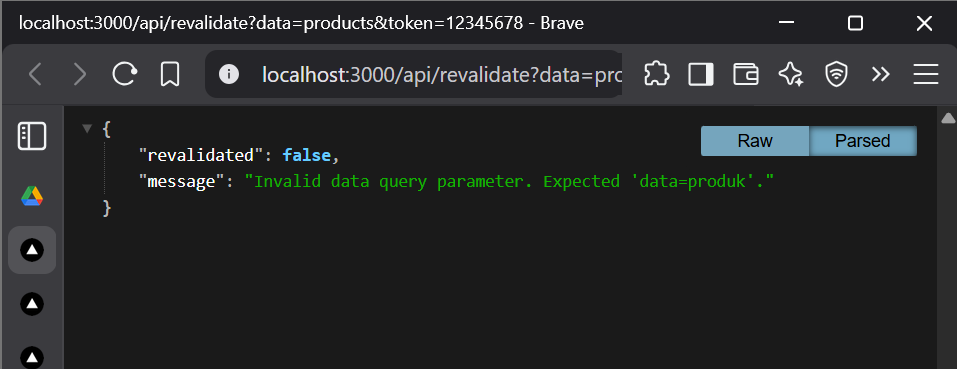

# Jobsheet 12 - Incremental Static Regeneration (ISR)

###  Langkah Praktikum

Bagian 1 - Tambahkan revalidate
---

<li><h3> Buka halaman static.tsx pada folder src/pages/produk</h3></li>

Artinya:

• Setiap 10 detik halaman akan dicek ulang

• Jika ada perubahan data → cache diperbarui

Bagian 2 - Pengujian ISR 
---

<li><h3> Jalankan npm run build dan npm run start: ( lakukan hal sama seperti JS sebelumnya untuk ngebuild SSG) </h3></li>

<li><h3>Tambahkan data baru di database pada firebase</h3></li>

<li><h3> Hasil : </h3></li>

Bagian 3 - Buat API Revalidate
---

<li><h3> Buat file revalidate.ts pada folder pages/api/ dan modifikasi </li>

Bagian 4 – Tambahkan Parameter Data
---

<li><h3> Modifikasi file revalidate.ts </i></li>

<li><h3> Uji coba menambahkan parameter dan value pada url
http://localhost:3000/api/revalidate?data=produk maka akan muncul true dan
sesuai dengan kondisi (req.query.data ===”produk”) </li>

<li><h3> Uji coba dengan url http://localhost:3000/api/revalidate?data= </li>

Bagian 5 – Tambahkan Token Security
---

<li><h3> Buka file .env dan modifikasi </li>

<li><h3> Modifikasi file revalidate.ts tambahkan kondisi pada line 13 - 17 </li>

### Pengujian Manual Revalidation 

### Pertanyaan Analisis

1. Mengapa ISR lebih fleksibel dibanding SSG?

Jawaban : karena halaman statis bisa diperbarui tanpa perlu build ulang seluruh aplikasi 

2. Apa perbedaan revalidate waktu dan on-demand?

Jawaban : Revalidate waktu membuat halaman otomatis diperbarui setelah interval tertentu (misalnya tiap 10 detik). Sedankan on-demand membuat halaman diperbarui hanya saat ada trigger khusus (misalnya dari API).

3. Mengapa endpoint revalidation harus diamankan?

Jawaban : Karena endpoint ini bisa memicu pembaruan halaman. Jika tidak diamankan, maka orang lain bisa mengaksesnya dan menyebabkan beban server meningkat atau perubahan data tanpa kontrol.

4. Apa risiko jika token tidak digunakan?

Jawaban : Endpoint terbuka untuk siapa saja dan terjadi penyalahgunaan seperti spam request, penurunan performa dan update data yang tidak terkendali

5. Kapan ISR lebih cocok dibanding SSR?

Jawaban : ISR lebih cocok saat data tidak harus real-time, tetapi tetap perlu update berkala seperti blog atau e-commerce