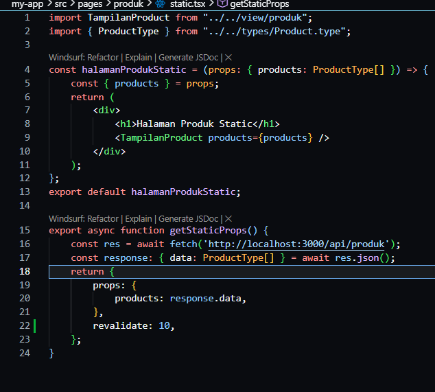
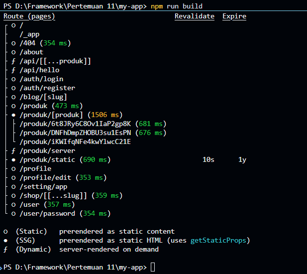
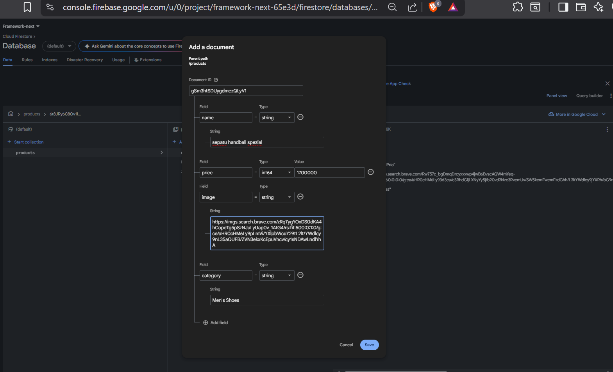
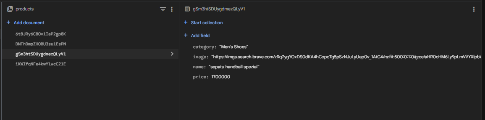
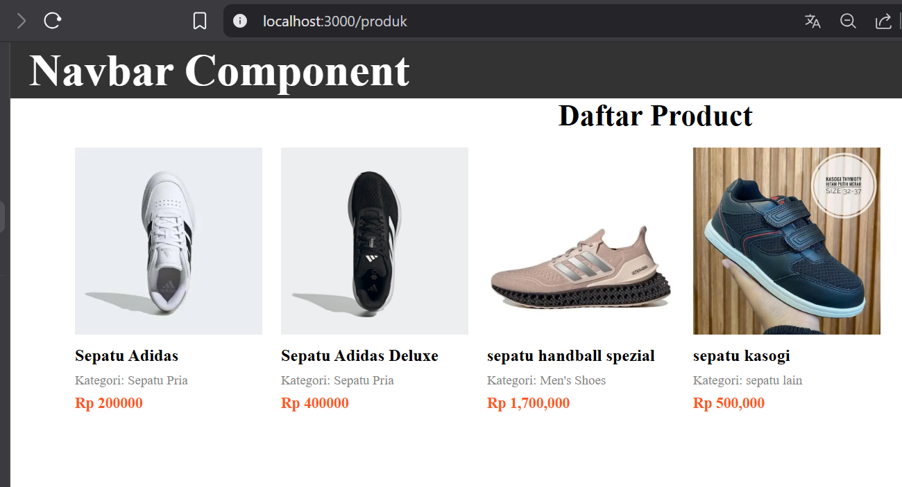

# Jobsheet 12 - Incremental Static Regeneration (ISR)

###  Langkah Praktikum

Bagian 1 - Tambahkan revalidate
---

<li><h3> Buka halaman static.tsx pada folder src/pages/produk</h3></li>

Artinya:

• Setiap 10 detik halaman akan dicek ulang

• Jika ada perubahan data → cache diperbarui

Bagian 2 - Pengujian ISR 
---

<li><h3> Jalankan npm run build dan npm run start: ( lakukan hal sama seperti JS sebelumnya untuk ngebuild SSG) </h3></li>

<li><h3>Tambahkan data baru di database pada firebase</h3></li>

<li><h3> Hasil : </h3></li>

Bagian 3 - Implementasi SSR
---

<li><h3> Modifikasi [produk].tsx pada folder src/pages/produk dan comment line 9 sampai 20
dikarena kita akan menggunakan metode SSR. Tambahkan beberapa kode untuk SSR </li>

<li><h3>Jalankan browser http://localhost:3000/produk/server </h3></li>

Bagian 4 – Implementasi Static Site Generation (Dynamic SSG)
---

<li><h3> Buka file [produk].tsx dan modifikasi seperti berikut </i></li>

<li><h3> Buka file index.tsx pada folder src/views/DetailProduct dan modifikasi pada line 11 </li>

<li><h3> Jalankan browser http://localhost:3000/produk </li>

### Pertanyaan Analisis

1. Mengapa getStaticPaths wajib pada dynamic SSG?

Jawaban : Karena Next.js perlu mengetahui daftar parameter (seperti ID) untuk membuat halaman dynamic saat build time. Tanpa ini, halaman tidak bisa digenerate. 

2. Mengapa CSR membutuhkan loading state?

Jawaban : Karena data diambil di sisi client setelah halaman ditampilkan, sehingga perlu indikator saat menunggu data.

3. Mengapa SSG tidak menampilkan produk baru tanpa build ulang?

Jawaban : Karena data diambil hanya pada saat build, sehingga perubahan setelah build tidak langsung terlihat

4. Mana metode terbaik untuk halaman detail e-commerce?

Jawaban : Menggunakan SSG + ISR, karena dibutuhkan performa yang cepat seperti SSG namun bisa memperbarui data secara berkala

5. Apa risiko menggunakan SSG untuk produk yang sering berubah?

Jawaban : data tidak menjadi up to date, sehingga data seperti harga atau stok yang sudah berubah tetapi masih menampilkan data yang lama