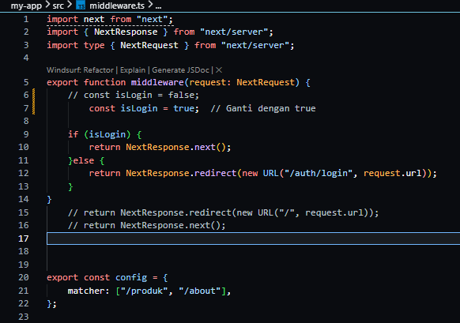
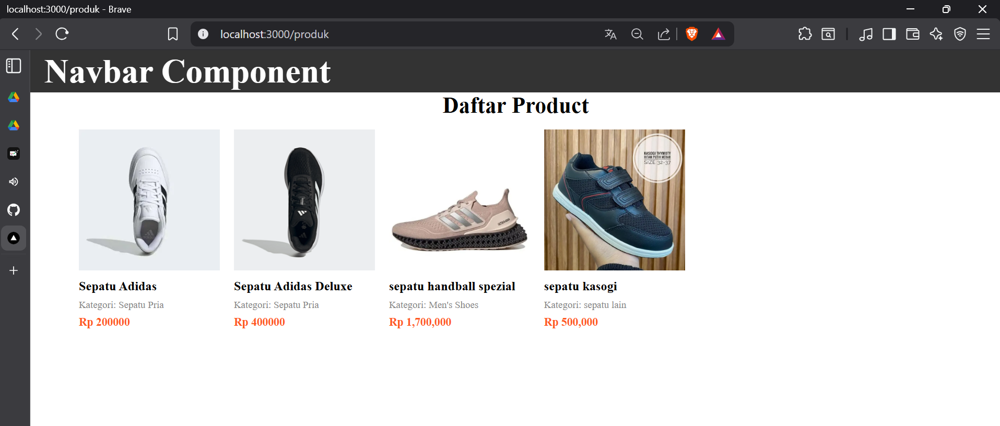
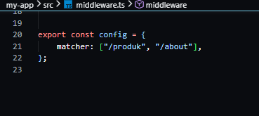

# Jobsheet 13 - Middleware & Route Protection 

###  Langkah Praktikum

Bagian 1 - Membuat Middleware
---

<li><h3> Modifikasi file index.ts pada folder src/pages/produk</h3></li>

<li><h3> Buat file: src/middleware.ts Sejajar dengan folder pages </h3></li>

Bagian 2 - Struktur Dasar Middleware
---

o Jika menggunakan NextResponse.next() → tidak ada redirect.

o Jadi masih bisa mengakses ke http://localhost:3000/produk

Bagian 3 - Redirect Sederhana
---

<li><h3> Semua halaman akan redirect ke home dan error dikarenakan terus menerus loading </li>

Bagian 4 – Batasi Route Tertentu
---

<li><h3> Untuk mengatasi pada bagian 3 maka perlu pembatasan route </i></li>

<li><h3> Artinya: </h3></li>

• Middleware hanya berlaku untuk /products dan /about

• Halaman lain tetap normal

• Ketika user mengakses halaman produk dan about maka akan langsung redirect
ke halaman home

Bagian 5 – Simulasi Sistem Login
---

<li><h3> Modifikasi file middleware.ts </li>

<li><h3> Jika user langsung mengakses ke alamat http://localhost:3000/produk tidak akan bisa
user akan diarahkan ke halaman login </li>

### Pengujian

<li><h3> Uji 1 – isLogin = false </h3></li>

<h4> Akses: /products </h4>

<h4> Hasil:
Redirect ke /login </h4>

<li><h3> Uji 2 – isLogin = true </h3></li>

<h4> Ubah:
const isLogin = true </h4>

<h4> Hasil:
Bisa mengakses /products</h4>

<li><h3>Uji 3 – Tambahkan Multiple Route </h3></li>

### Tugas Praktikum 

1. Buat halaman:

o /products

o /about

o /login

2. Implementasikan Middleware:

o Redirect ke /login jika belum login.

o Izinkan akses jika login true.

3. Tambahkan proteksi hanya untuk route tertentu.

4. Dokumentasikan:

o Screenshot sebelum dan sesudah redirect.

o Perbandingan dengan useEffect.

### Pertanyaan Analisis

1. Mengapa middleware lebih aman dibanding useEffect?

Jawaban : karena halaman statis bisa diperbarui tanpa perlu build ulang seluruh aplikasi 

2. Mengapa middleware tidak menimbulkan glitch?

Jawaban : Revalidate waktu membuat halaman otomatis diperbarui setelah interval tertentu (misalnya tiap 10 detik). Sedankan on-demand membuat halaman diperbarui hanya saat ada trigger khusus (misalnya dari API).

3. Apa risiko jika semua halaman diproteksi tanpa pengecualian?

Jawaban : Karena endpoint ini bisa memicu pembaruan halaman. Jika tidak diamankan, maka orang lain bisa mengaksesnya dan menyebabkan beban server meningkat atau perubahan data tanpa kontrol.

4. Kapan middleware tidak diperlukan?

Jawaban : Endpoint terbuka untuk siapa saja dan terjadi penyalahgunaan seperti spam request, penurunan performa dan update data yang tidak terkendali

5. Apa perbedaan middleware dan API route?

Jawaban : ISR lebih cocok saat data tidak harus real-time, tetapi tetap perlu update berkala seperti blog atau e-commerce