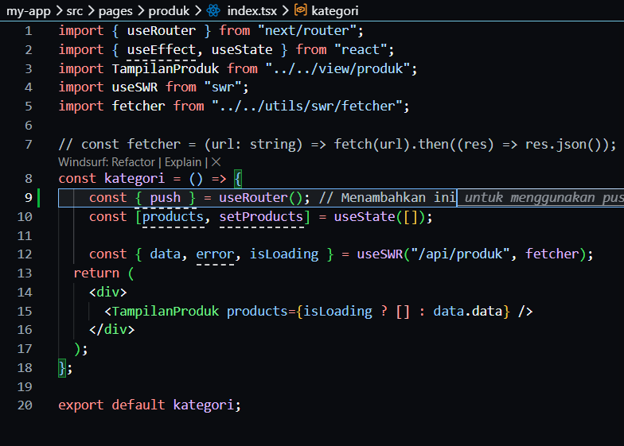
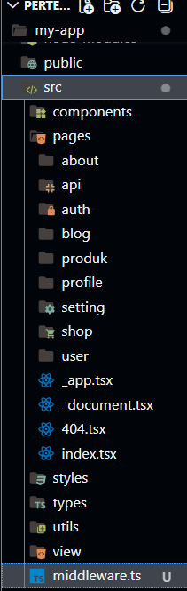
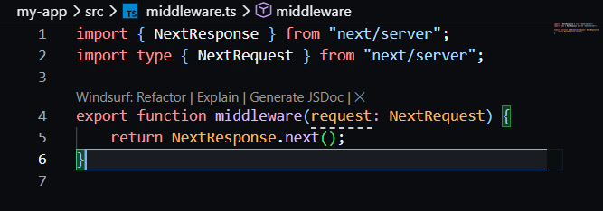
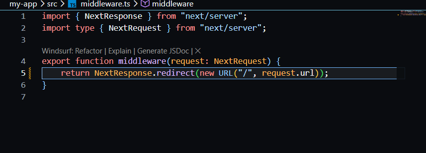
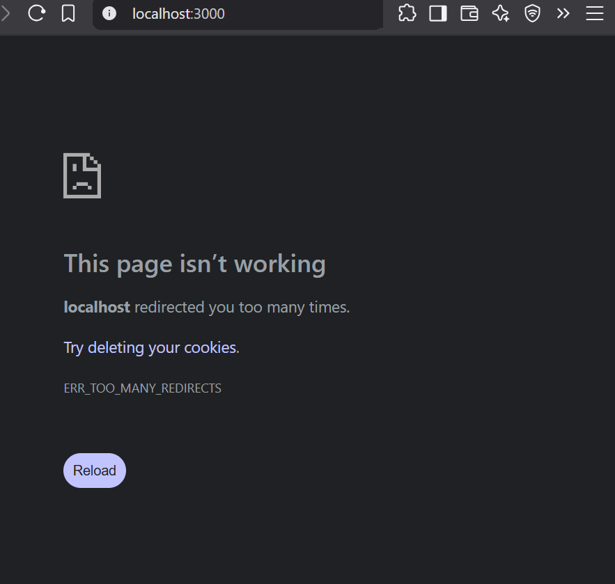
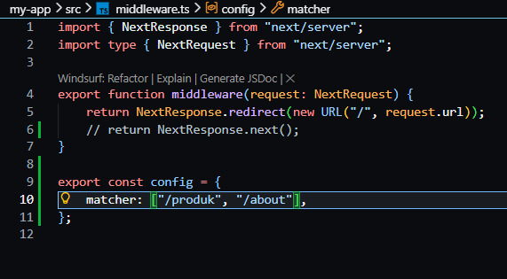
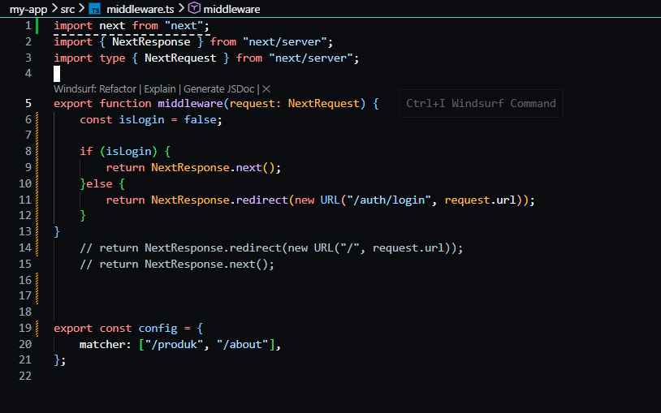
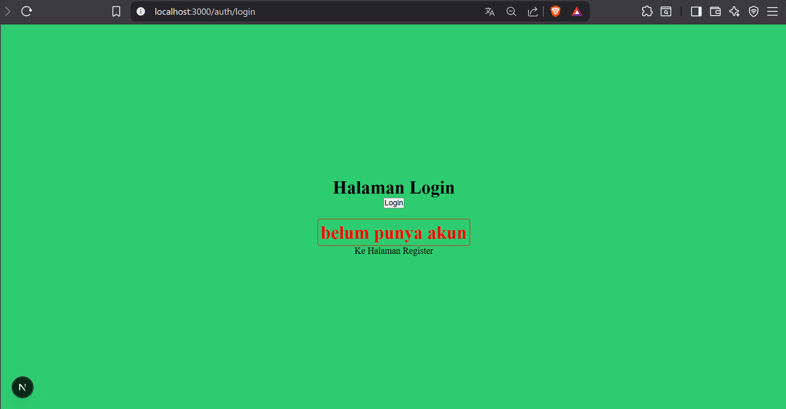

# Jobsheet 13 - Middleware & Route Protection 

###  Langkah Praktikum

Bagian 1 - Membuat Middleware
---

<li><h3> Modifikasi file index.ts pada folder src/pages/produk</h3></li>

<li><h3> Buat file: src/middleware.ts Sejajar dengan folder pages </h3></li>

Bagian 2 - Struktur Dasar Middleware
---

o Jika menggunakan NextResponse.next() → tidak ada redirect.

o Jadi masih bisa mengakses ke http://localhost:3000/produk

Bagian 3 - Redirect Sederhana
---

<li><h3> Semua halaman akan redirect ke home dan error dikarenakan terus menerus loading </li>

Bagian 4 – Batasi Route Tertentu
---

<li><h3> Untuk mengatasi pada bagian 3 maka perlu pembatasan route </i></li>

<li><h3> Artinya:

• Middleware hanya berlaku untuk /products dan /about
• Halaman lain tetap normal
• Ketika user mengakses halaman produk dan about maka akan langsung redirect
ke halaman home</li>

Bagian 5 – Tambahkan Token Security
---

<li><h3> Buka file .env dan modifikasi </li>

<li><h3> Modifikasi file revalidate.ts tambahkan kondisi pada line 13 - 17 </li>

### Pengujian Manual Revalidation 

### Pertanyaan Analisis

1. Mengapa ISR lebih fleksibel dibanding SSG?

Jawaban : karena halaman statis bisa diperbarui tanpa perlu build ulang seluruh aplikasi 

2. Apa perbedaan revalidate waktu dan on-demand?

Jawaban : Revalidate waktu membuat halaman otomatis diperbarui setelah interval tertentu (misalnya tiap 10 detik). Sedankan on-demand membuat halaman diperbarui hanya saat ada trigger khusus (misalnya dari API).

3. Mengapa endpoint revalidation harus diamankan?

Jawaban : Karena endpoint ini bisa memicu pembaruan halaman. Jika tidak diamankan, maka orang lain bisa mengaksesnya dan menyebabkan beban server meningkat atau perubahan data tanpa kontrol.

4. Apa risiko jika token tidak digunakan?

Jawaban : Endpoint terbuka untuk siapa saja dan terjadi penyalahgunaan seperti spam request, penurunan performa dan update data yang tidak terkendali

5. Kapan ISR lebih cocok dibanding SSR?

Jawaban : ISR lebih cocok saat data tidak harus real-time, tetapi tetap perlu update berkala seperti blog atau e-commerce