# Jobsheet 14 - Sistem Autentikasi & Proteksi Route 

###  Langkah Praktikum

Bagian 1 - Install NextAuth
---

<li><h3> npm install next-auth –force </h3></li>

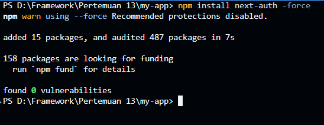

Bagian 2 - Konfigurasi API Auth
---

<li><h3> Buat file dan folder pada folder pages/api/auth/[...nextauth].ts </h3></li>

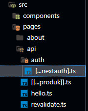

<li><h3> Modifikasi file [...nextauth].ts </h3></li>

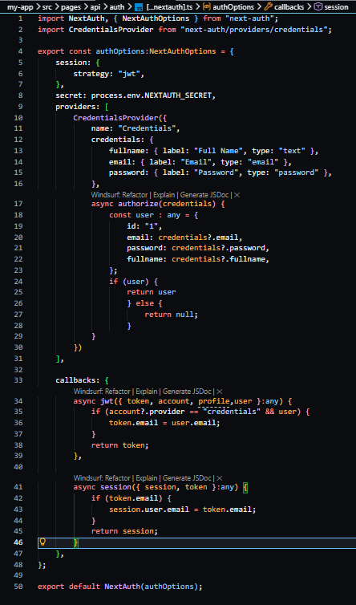

Bagian 3 - Tambahkan Secret
---

<li><h3> Buka file .env.local dan tambahkan code pada line 12 </li> 

`NEXTAUTH_SECRET=RANDOM_BASE64_STRING`

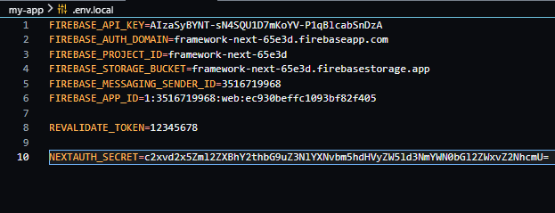

Bagian 4 – Tambahkan SessionProvider
---

<li><h3> Buka file _app.tsx dan modifikasi </i></li>

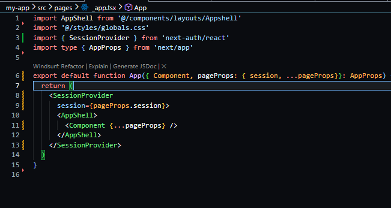

Bagian 5 – Tambahkan Tombol Login & Logout
---

<li><h3> Buka index.tsx pada folder component/navbar dan modifikasi file index.tsx pada line 10 dan 2  </li>

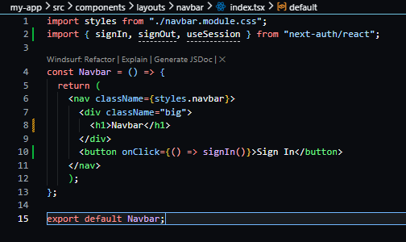

<li><h3> Buka file file navbar.module.scss tambahkan code pada line 9 </li>

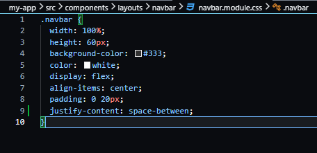

<li><h3>Jalankan http://localhost:3000/ </li>

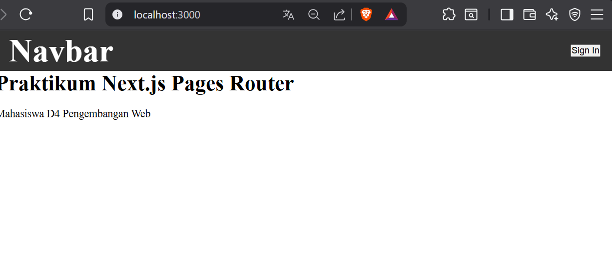

<li><h3>Jika di klik sign in maka akan muncul dan isikan textbox masing. Setelah itu klik button sign in dan setelah diklik maka akan kembali ke halaman localhost </li>

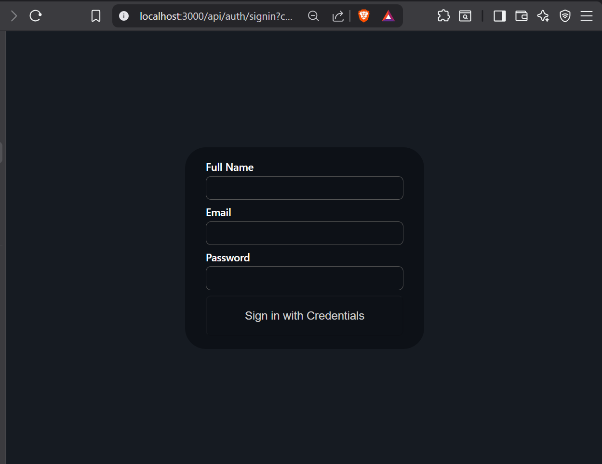

<li><h3>Setelah berhasil login maka akan muncul session</li>

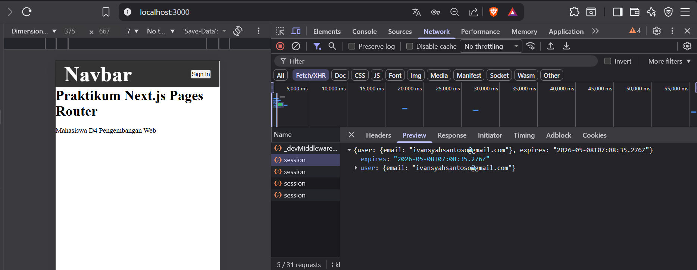

<li><h3>Untuk dapat menangkap data pada session maka tambahkan code sebagai berikut :</li>

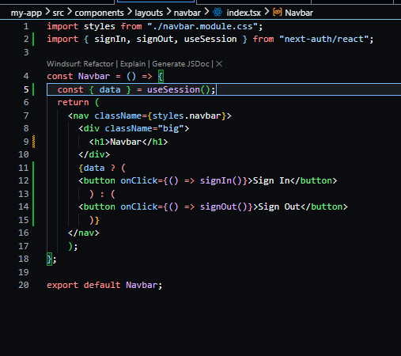

<li><h3>Uji coba sign in dan sign out</li>

o Jalankan localhost

o Klik sign in dan isikan textboxnya

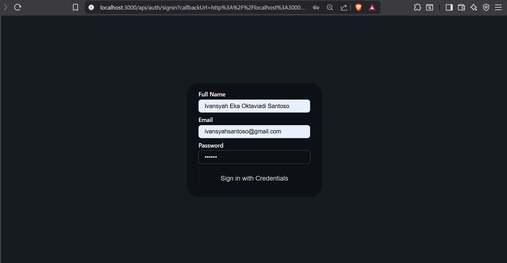

o Maka akan muncul tombol signout

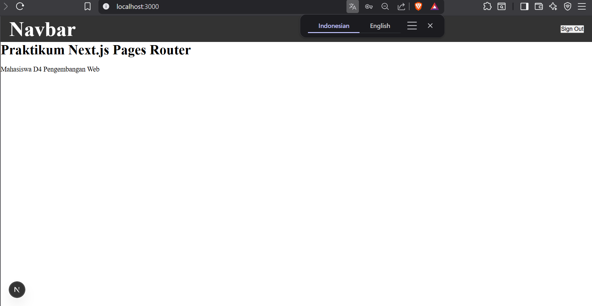

o Ketika user klik signout maka akan kembali sign in .

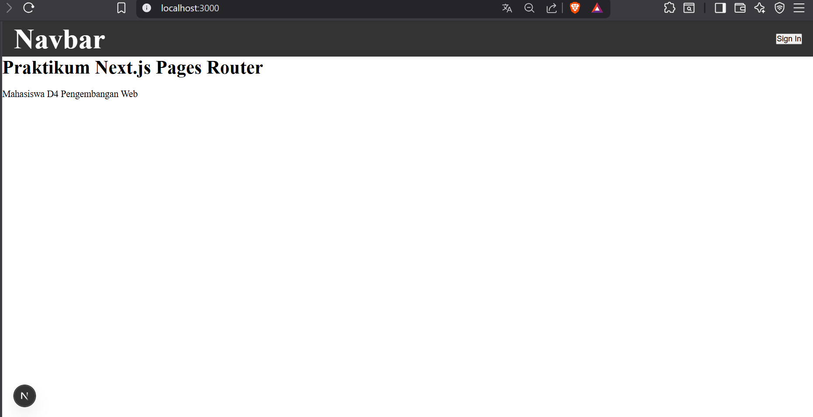

### Pengujian

<li><h3>Uji 1 - Belum Login </h3></li>

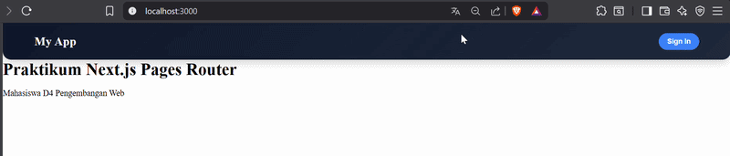

Jika belum login/sign in, kita tidak bisa mengakses halaman profile 

<li><h3> Uji 2 - Sudah Login </h3></li>

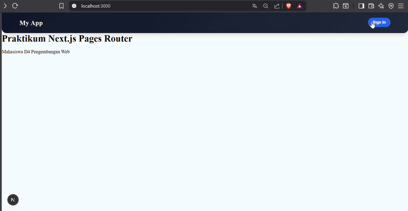

Jika sudah login/sign in, kita bisa mengakses halaman profile 

<li><h3> Uji 3 - Logout </h3></li>

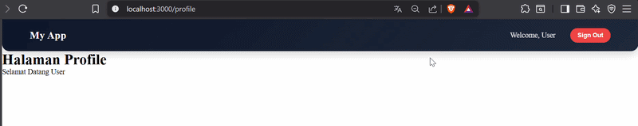

Ketika kita sudah login/sign in lalu logout, maka kita tidak bisa mengakses halaman profile lagi 

### Pertanyaan Analisis

1. Mengapa session menggunakan JWT?

Jawaban : JWT digunakan karena semua informasi user disimpan di dalam token, sehingga lebih ringan dan cocok untuk aplikasi modern seperti API atau Next.js

2. Apa perbedaan authorize() dan callback jwt()?

Jawaban : `authorize()` digunakan saat proses login guna memvalidasi kredensial user (misalnya email & password). Sedangkan `jwt()` adalah callback yang berjalan setelah login untuk menyimpan atau memodifikasi data ke dalam token JWT

3. Mengapa middleware perlu getToken()?

Jawaban : Untuk mengambil dan membaca JWT dari request dan juga untuk mengecek apakah user sudah login atau belum sebelum mengakses halaman tertentu

4. Apa risiko jika NEXTAUTH_SECRET tidak digunakan?

Jawaban : JWT tidak terlindungi dengan baik yang resikonya token bisa dipalsukan, data bisa dimanipulasi, dan sistem jadi tidak aman karena tidak ada validasi signature token

5. Apa perbedaan autentikasi dan otorisasi dalam sistem ini?

Jawaban : Autentikasi adalah proses menentukan siapa pengguna/user(login). Sedangkan otorisasi adalah proses menentukan apa yang boleh diakses user/pengguna setelah login