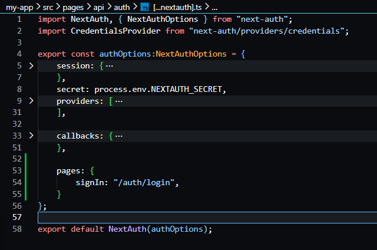
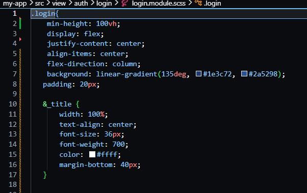
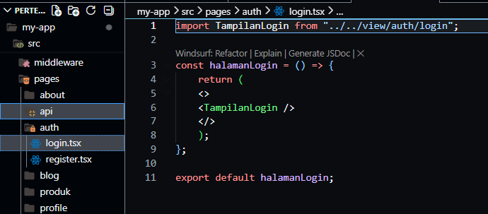
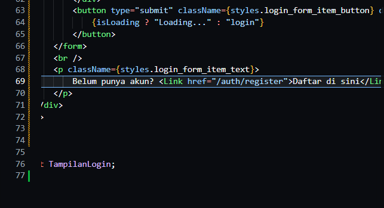
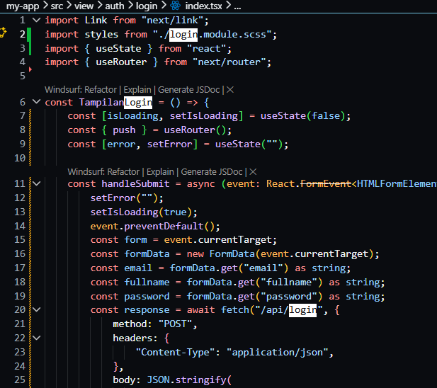
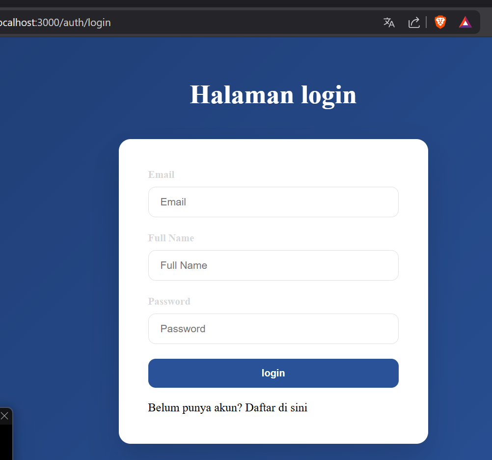
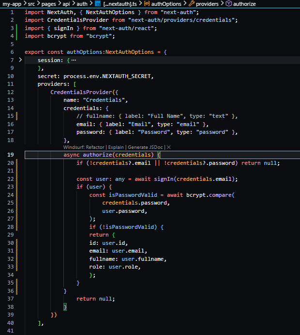

# Jobsheet 16 - Implementasi Login Database & Multi-Role

###  Langkah Praktikum

Bagian 1 - Custom Login Page
---

<li><h3>Tambahkan custom page di NextAuth line 55-57 </h3></li>

<li><h3>Jalankan browser http://localhost:3000/ dan klik sign in maka akan diarahkan ke
login </h3></li>

Bagian 2 - Membuat API Register
---

<li><h3>Buka file servicefirebase.ts pada folder src/utils/db dan modifikasi </h3></li>

<li><h3> Buat file register.ts pada folder api </h3></li>

<li><h3>Modifikasi file register.ts </h3></li>

<li><h3>Modifikasi index.tsx pada folder register ( tambahkan beberapa code)</h3></li>

<li><h3>Buka browser http://localhost:3000/auth/register isikan data dan klik register. Jika
berhasil maka akan masuk ke menu login</h3></li>

Bagian 3 - Install bcrypt
---

<li><h3>npm install bcrypt --force </li> 

<li><h3>npm install --save-dev @types/bcrypt –force</li> 

<li><h3>Buka file servicefirebase.ts pada folder src/utils/db dan modifikasi</li> 

<li><h3>Jalankan browser http://localhost:3000/auth/register dan input data setelah itu klik
register</li> 

<li><h3>Buka pada firebase jika berhasil maka data register akan masuk</li> 

<li><h3>Jika user memasukkan data yang sama sistem tidak akan memproses tetapi
permasalahannya user memasukkan data yang sama tidak ada pemberitahuan pada
layar maka dari itu perlu ada perubahan pada code index.tsx pada folder
views/auth/register</li> 

<li></h3>Modifikasi juga pada register.module.scss</h3></li>

<li><h3>Jika berhasil maka hasilnya seperti berikut</h3></li>

<li><h3>Tambakan loading dengan menambahkan kode pada index.tsx</h3></li>

[images](images/Hasil3.8.png)

### Pertanyaan Individu

1. Mengapa password harus di-hash? 

Jawaban : Agar tidak disimpan dalam bentuk asli (plain text), sehingga lebih aman jika database bocor.

2. Apa perbedaan addDoc dan setDoc? 

Jawaban : addDoc: ID dibuat otomatis oleh Firebase setDoc: ID ditentukan sendiri

3. Mengapa perlu validasi method POST? 

Jawaban : Untuk memastikan endpoint hanya menerima request yang sesuai (mencegah akses tidak sah seperti GET/PUT).

4. Apa risiko jika email tidak dicek unik? 

Jawaban : Risiko jika email tidak unik
Bisa terjadi duplikasi akun, membingungkan sistem login, dan berpotensi disalahgunakan.

5. Apa fungsi role pada user?

Jawaban : Untuk mengatur hak akses (misalnya admin atau user biasa).