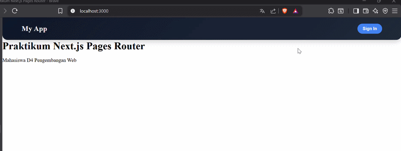
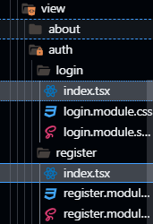
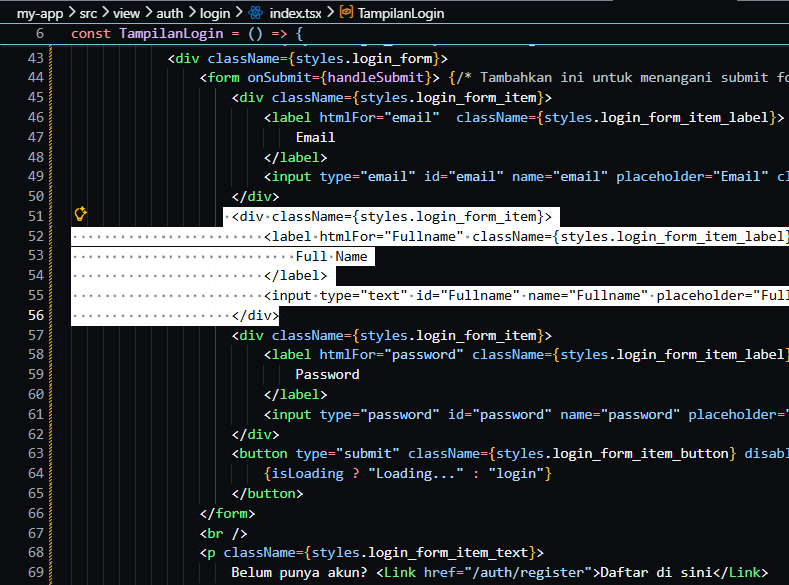
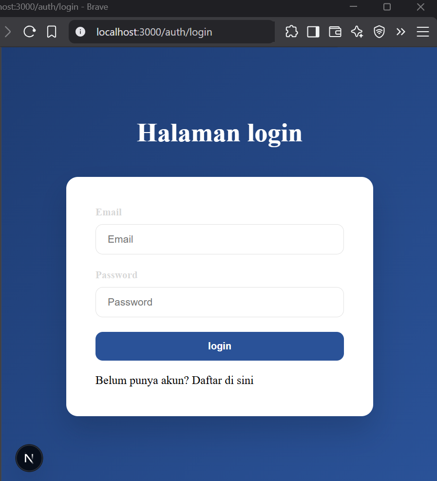
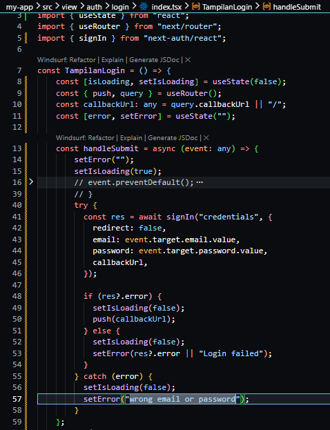
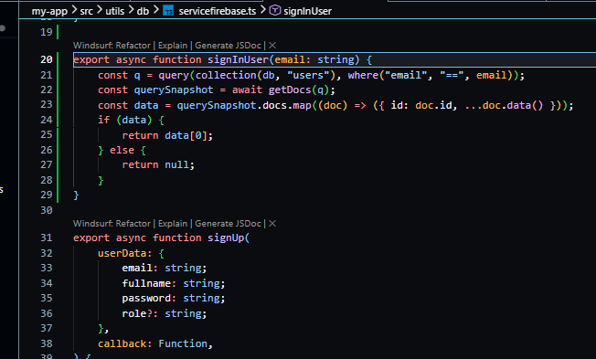

# Jobsheet 16 - Implementasi Login Database & Multi-Role

###  Langkah Praktikum

Bagian 1 - Custom Login Page
---

<li><h3>Tambahkan custom page di NextAuth line 55-57 </h3></li>

<li><h3>Jalankan browser http://localhost:3000/ dan klik sign in maka akan diarahkan ke
login </h3></li>

Bagian 2 - Handle Login di Frontend
---

<li><h3>Copy paste isi dari register/index.tsx ke file login/index.tsx</h3></li>

<li><h3>Copy paste isi dari register/register.module.scss ke file login/login.module.scss</h3></li>
<li><h3>Semua text register pada file index.tsx pada folder login diubah menjadi login</h3></li>

<li><h3>Jangan lupa setting link hrefnya</h3></li>

<li><h3>Lakukan hal yang sama pada file login.module.scss rubah text register menjadi login</h3></li>

<li><h3>Cek pada file login.tsx pada pages/auth</h3></li>

<li><h3>Jalankan browser localhost:3000/auth/login. Tampilannya akan sama dengan register</h3></li>

<li><h3>Pada tampilan login kita tidak perlu hapus fullname jadi pada folder views/auth/login/index.tsx hapus fullname</h3></li>

<li><h3>Hasilnya : </h3></li>

<li><h3>Buka file index.tsx pada folder views/auth/login dan modifikasi codenya seperti berikut ( Untuk line 64 sampai kebawah tidak ada perubahan )</h3></li>

<li><h3>Buka file servicefirebase.ts dan tambahkan code di line 25-38</h3></li>

Bagian 3 - Authorize di NextAuth (Database Login)
---

<li><h3>Buka file [...nextauth].ts modifikasi menjadi berikut ( pada bagian providers ) </li> 

Bagian 4 - Tambahkan Role ke Token
---

<li><h3>JWT Callback pada file [...nextauth].ts Modifikasi menjadi </h3></li>

[images](images/Kode4.png)

<li><h3> Jalankan browser http://localhost:3000/auth/login </h3></li>

[images](images/Hasil4.png)

[images](images/Hasil4.1.png)

### Pertanyaan Individu

1. Mengapa password harus diverifikasi dengan bcrypt.compare?

Jawaban : Karena password di database sudah di-hash, jadi tidak bisa dibandingkan langsung. bcrypt.compare digunakan untuk mencocokkan password input dengan hash secara aman.

2. Mengapa role disimpan di token?

Jawaban : Agar server bisa mengetahui hak akses user tanpa perlu query database berulang kali (lebih efisien dan cepat).

3. Apa fungsi callbackUrl?

Jawaban : Untuk menentukan halaman tujuan setelah login/logout (redirect user ke halaman yang diinginkan).

4. Mengapa middleware penting untuk security?

Jawaban : Middleware berfungsi sebagai penjaga awal untuk memvalidasi request (cek login, token, role) sebelum user mengakses halaman tertentu.

5. Apa risiko jika role tidak dicek di middleware?

Jawaban : User bisa mengakses halaman atau fitur yang bukan haknya (misalnya user biasa masuk ke halaman admin).