# Jobsheet 17 - Implementasi Login Google Provider dengan NextAuth.js + Firebase

###  Langkah Praktikum

Bagian 1 - Konfigurasi Google OAuth
---

<li><h3>Langkah 1 – Masuk ke Google Cloud Console Buka: https://console.cloud.google.com/apis/credentials</h3></li>

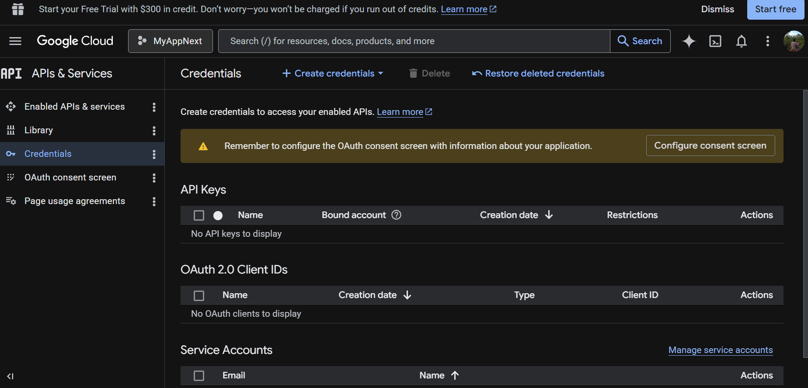

<li><h3>Langkah 2 – Buat Project Baru </h3></li>

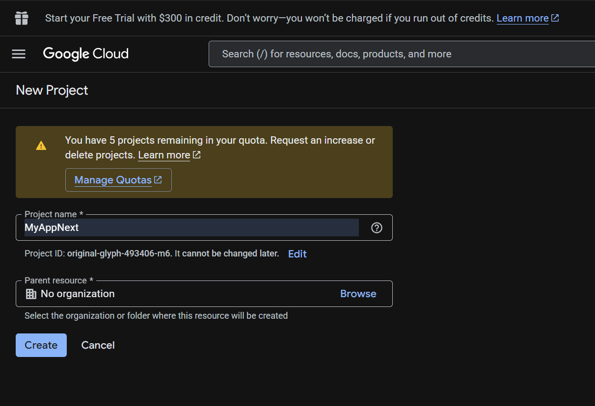

<li><h4>Klik New Project </h4></li>

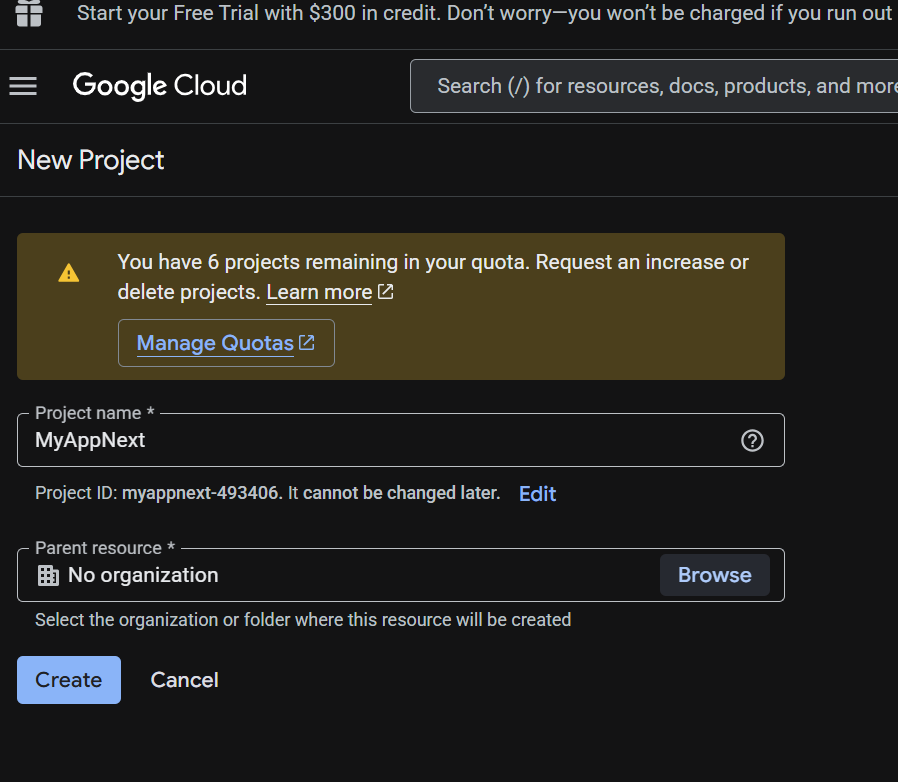

<li><h4>Nama project: MyAppNext </h4></li>

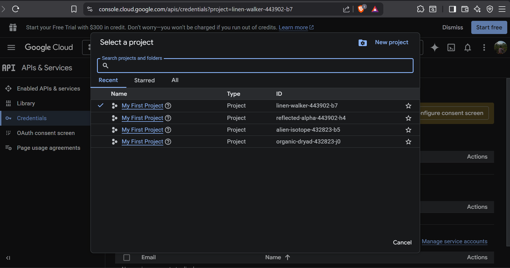

<li><h4>Klik Create: Setelah berhasil klik https://console.cloud.google.com/apis/credentials pastikan
projectnya MyAppNext </h4></li>

<li><h3>Langkah 3 – Konfigurasi OAuth Consent Screen </h3></li>

<li><h4>Pilih OAuth Consenst Screen dan Pilih Get Started </h4></li>

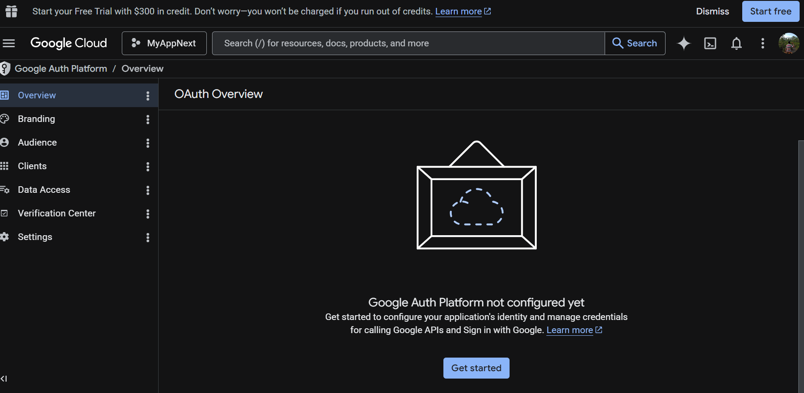

<li><h4>Isikan </h4></li>

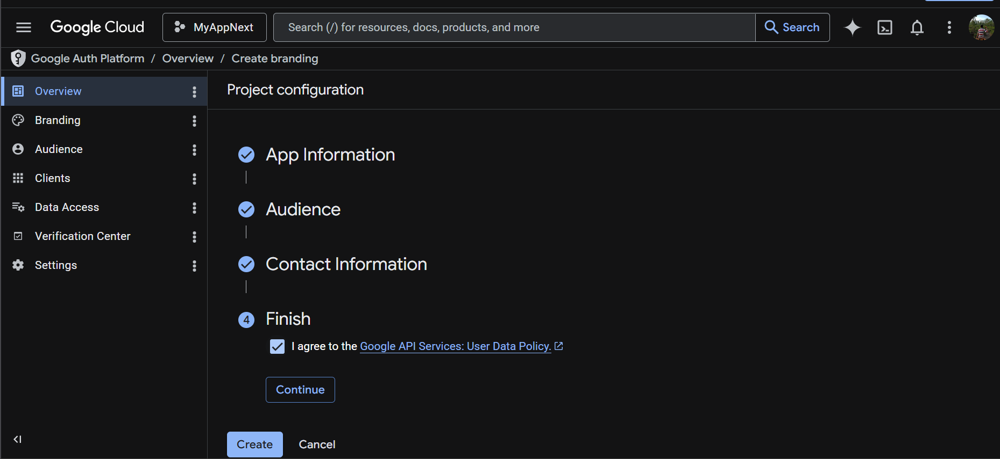

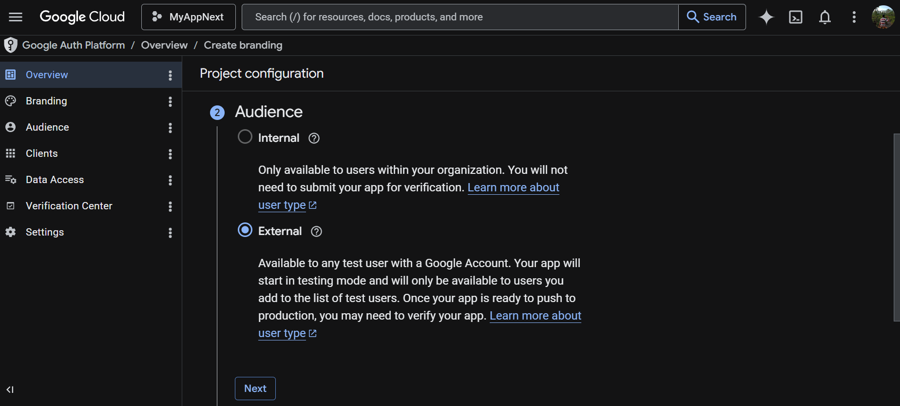

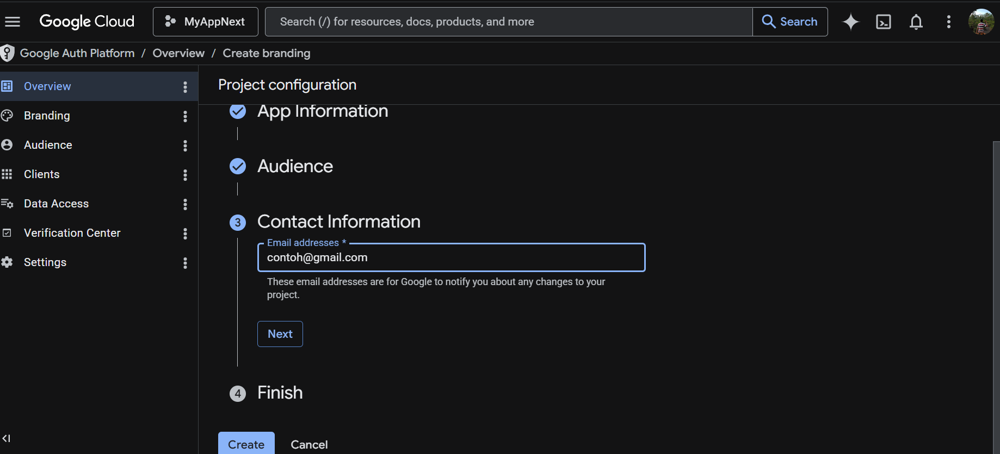

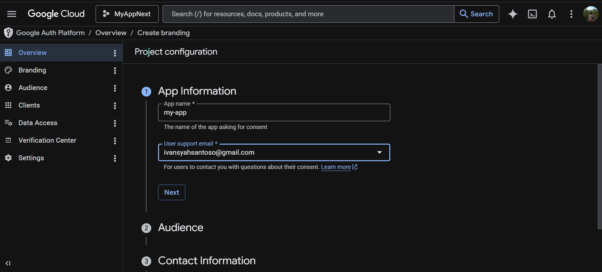

<li><h3>Langkah 4 – Buat OAuth Credentials </h3></li>

<li><h4>Klik create client pada Clients</h4></li>

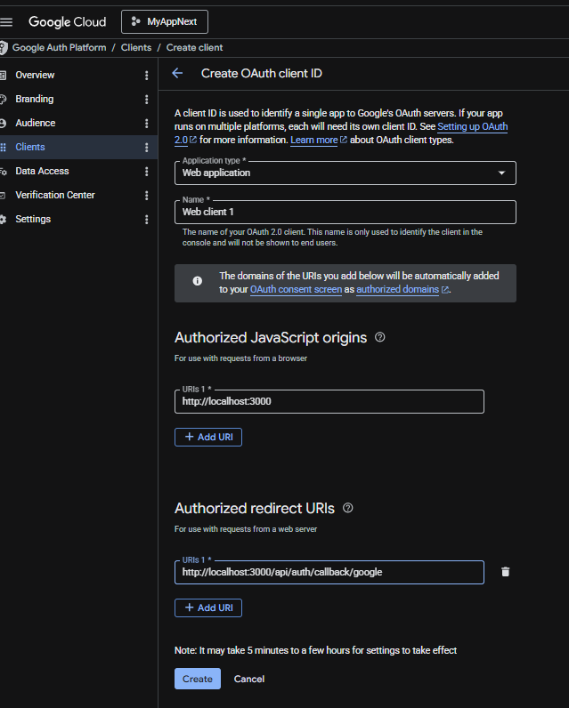

Bagian 2 - Tambahkan Environment Variables
---

<li><h3>Copy dan paste client ID dan Client secret ke .env</h3></li>

Bagian 3 -Konfigurasi Google Provider di NextAuth dan Handle Callback JWT & Session
---

<li><h3>Buka file [...nextauth].ts pada folder api/auth dan modifikasi menjadi berikut </li> 

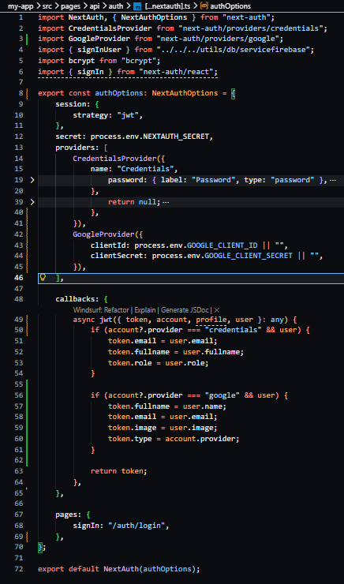

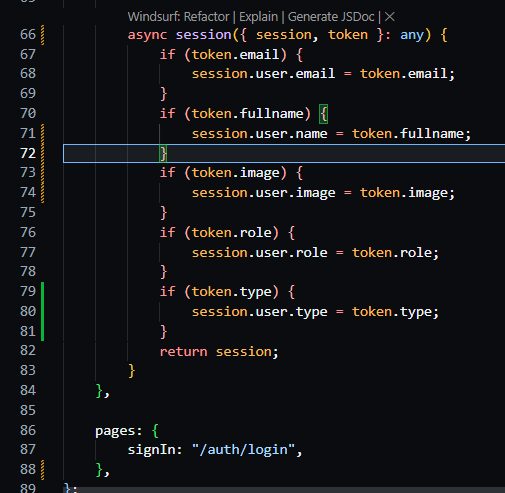

Bagian 4 - Tambahkan Button Login Google
---

<li><h3>Modifikasi file index.tsx pada folder views/auth/login</h3></li>

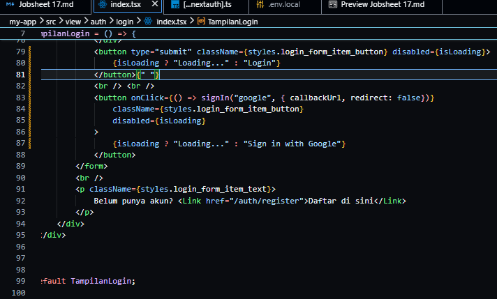

<li><h3> Jalankan browser localhost:3000/auth/login masuk melalui sign in with google.Jika
berhasil maka akan terhubung dengan akun google. </h3></li>

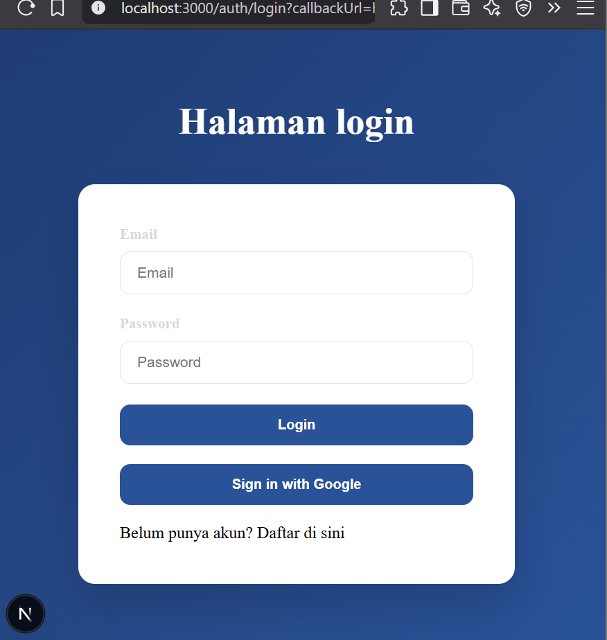

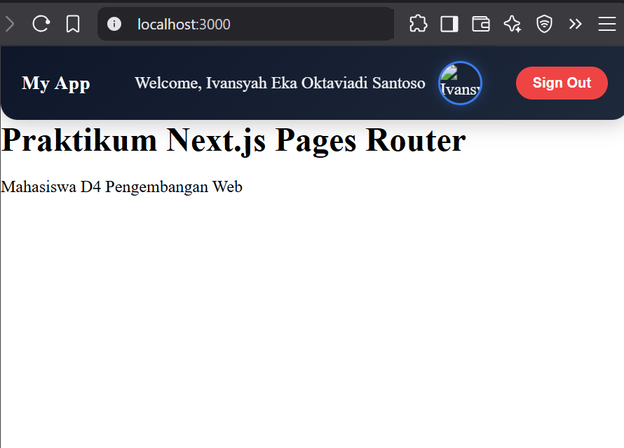

<li><h3>Menampilkan image dari google</h3></li>

Bagian 5 - Simpan Data Google ke Database
---

<li><h3> Modifikasi withAuth.ts pada folder src/middleware </h3></li>

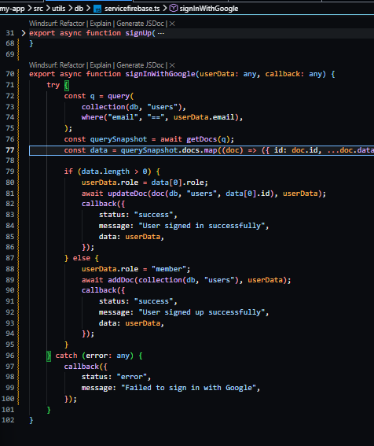

Bagian 6 - Membuat halaman Admin dan authoriz
---

<li><h3> Buat halaman admin </h3></li>

<li><h3> Pada index.tsx tambahkan code berikut </h3></li>

<li><h3> Modifikasi withAuth.ts </h3></li>

<li><h3> Jalankan browser localhost:3000/produk dan pada status sudah login. Rubah urlnya
menjadi http://localhost:3000/admin maka user akan diarahkan ke localhost. Pada
intinya role selain admin tidak bisa mengakses </h3></li>

### Pertanyaan Individu

1. Mengapa password harus diverifikasi dengan bcrypt.compare?

Jawaban : Karena password di database sudah di-hash, jadi tidak bisa dibandingkan langsung. bcrypt.compare digunakan untuk mencocokkan password input dengan hash secara aman.

2. Mengapa role disimpan di token?

Jawaban : Agar server bisa mengetahui hak akses user tanpa perlu query database berulang kali (lebih efisien dan cepat).

3. Apa fungsi callbackUrl?

Jawaban : Untuk menentukan halaman tujuan setelah login/logout (redirect user ke halaman yang diinginkan).

4. Mengapa middleware penting untuk security?

Jawaban : Middleware berfungsi sebagai penjaga awal untuk memvalidasi request (cek login, token, role) sebelum user mengakses halaman tertentu.

5. Apa risiko jika role tidak dicek di middleware?

Jawaban : User bisa mengakses halaman atau fitur yang bukan haknya (misalnya user biasa masuk ke halaman admin).