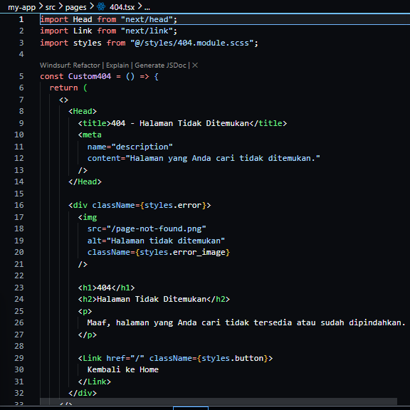
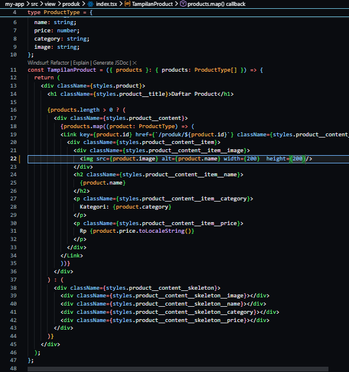
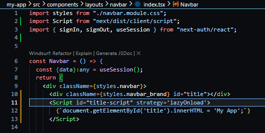
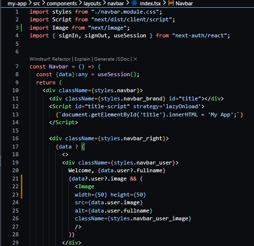
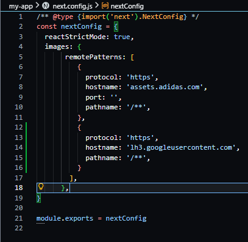

# Jobsheet 18 - Optimasi Performa Aplikasi Menggunakan Fitur Next.js

###  Langkah Praktikum

Praktikum 1 - Image Optimization
---

<li><h3>A. Optimasi Gambar Lokal (Public Folder)</h3></li>

<li><h4>Buka file src/pages/404.tsx dengan next/image dan modifikasi line 7 menjadi line 8-11</h4></li>

<li><h3>B. Optimasi Gambar Remote (External URL)</h3></li>

<li><h4>Buka file views/product/index.tsx dan modifikasi kodenya</h4></li>

<li><h4>Buka file next.config.js </h4></li>

<li><h4>Nama project: MyAppNext </h4></li>

Bagian 2 - Tambahkan Environment Variables
---

<li><h3>Copy dan paste client ID dan Client secret ke .env</h3></li>

Bagian 3 -Konfigurasi Google Provider di NextAuth dan Handle Callback JWT & Session
---

<li><h3>Buka file [...nextauth].ts pada folder api/auth dan modifikasi menjadi berikut </li> 

Bagian 4 - Tambahkan Button Login Google
---

<li><h3>Modifikasi file index.tsx pada folder views/auth/login</h3></li>

<li><h3> Jalankan browser localhost:3000/auth/login masuk melalui sign in with google.Jika
berhasil maka akan terhubung dengan akun google. </h3></li>

<li><h3>Menampilkan image dari google</h3></li>

<li><h3>Buka file navbar.module.css dan tambahkan code berikut</h3></li>

<li><h3> Hasil: </h3></li>

Bagian 5 - Simpan Data Google ke Database
---

<li><h3>Buka file servicefirebase.ts pada folder src/utils/db/ dan tambahkan beberapa
kode beriku dan tambahkan juga code berikut </h3></li>

<li><h3>Panggil Service di JWT Callback buka file [...nextAuth].ts</h3></li>

<li><h3>Jalankan browser dan login menggunakan akun google setelah cek di firebase, jika
data akun googlenya masuk ke database maka anda telah berhasil</h3></li>

### Pertanyaan Individu

1. Apa perbedaan login credential dan login Google?

Jawaban : Credential memakai email & password yang disimpan sendiri di database. Sedangkan Google memakai akun Google (OAuth), tanpa perlu simpan password di sistem kita.

2. Mengapa data Google tetap perlu disimpan ke database?

Jawaban : Agar aplikasi punya data user sendiri (role, profil, histori, dll) yang tidak disediakan penuh oleh Google.

3. Apa fungsi JWT callback?

Jawaban : Untuk menyimpan dan mengatur data penting (seperti email, role) ke dalam token agar bisa digunakan di seluruh aplikasi tanpa query ulang ke database.

4. Mengapa perlu multi-role?

Jawaban : Untuk membedakan hak akses user (misalnya admin, user) sehingga tiap user hanya bisa mengakses fitur sesuai perannya.

5. Apa risiko jika tidak menyimpan user ke database?

Jawaban : Tidak bisa mengatur role, menyimpan data tambahan, atau mengelola user (semua bergantung ke provider seperti Google).