# Jobsheet 19 - Implementasi Unit Testing pada Next.js menggunakan Jest

###  Langkah Praktikum

Praktikum 1 - Setup Jest di Next.js
---

<li><h3>1. Install Dependencies</h3></li>

<li><h4>Jalankan : npm install jest jest-environment-jsdom @testing-library/react @testing-library/jest-dom --save-dev --force</h4></li>

<li><h3>2. Buat File Konfigurasi</h3></li>

<li><h4>Buat file:
o jest.config.mjs dan modifikasi </h4></li>

<li><h3>3. Tambahkan Script di package.json</h3></li>

Praktikum 2 - Struktur Folder Testing
---

<li><h3>Buat folder: src/_test_/</h3></li>

Praktikum 3 - Testing Halaman About
---

<li><h3>Buat File Testing </li> 
<li><h4>src/__test__/pages/about.spec.tsx </h4></li>

<li><h3> Contoh Testing Snapshot. Pada about.spec.tsx tambahkan code berikut :</h3></li>

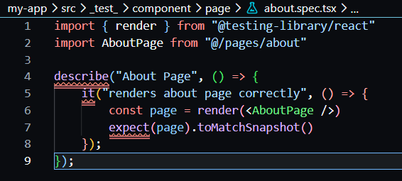

<li><h3>Jalan Testing </li> 
<li><h4>npm run test, jika berhasil PASS about.spec.tsx</h4></li>

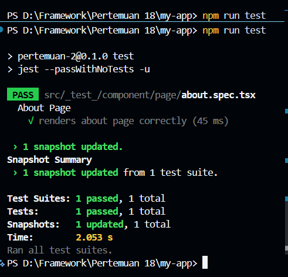

Praktikum 4 – Coverage Report
---

<li><h3>Jalankan: npm run test:coverage</h3></li>

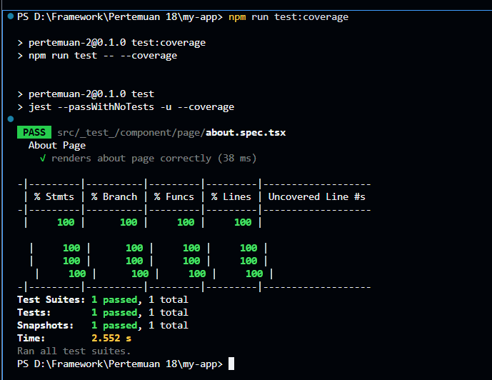

<li><h3> Akan muncul folder dan Buka:
▪ coverage/lcov-report/index.html ( buka di melalui explorer) </h3></li>
Minimum 80% coverage

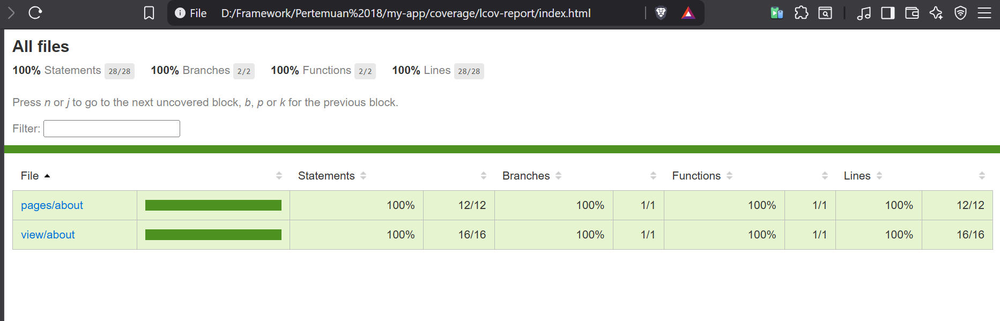

Praktikum 5 – Konfigurasi Coverage Lengkap
---

<li><h3>Update jest.config.mjs:</h3></li>

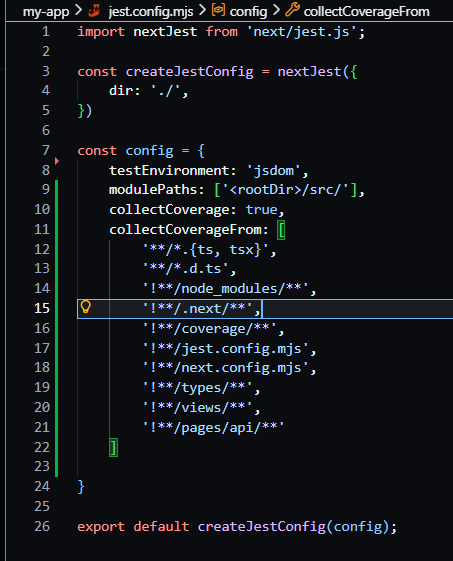

<li><h3> Jalankan npm run test:coverage </h3></li>

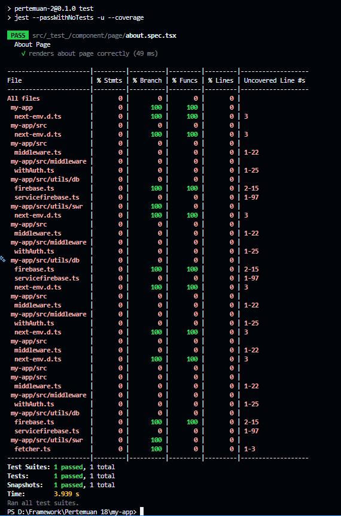

<li><h3> Jika dilihat di index.htmlnya </h3></li>

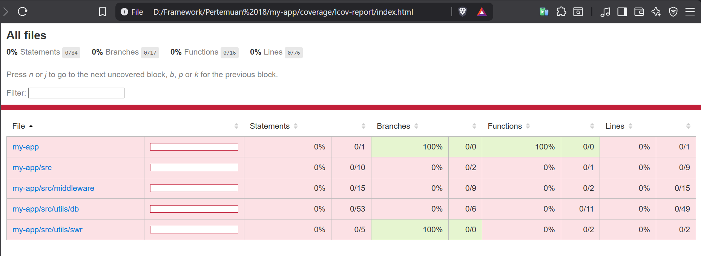

Praktikum 6 – Testing dengan getByTestId
---

<li><h3>Tambahkan pada About Page </h3></li>

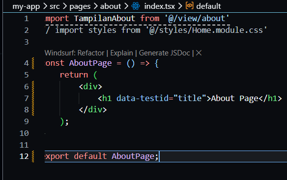

<li><h3> Update Testing pada about.spec.tsx </h3></li>

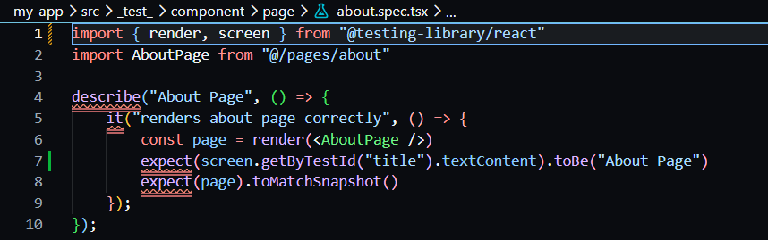

<li><h3> Dicoba untuk di run </h3></li>

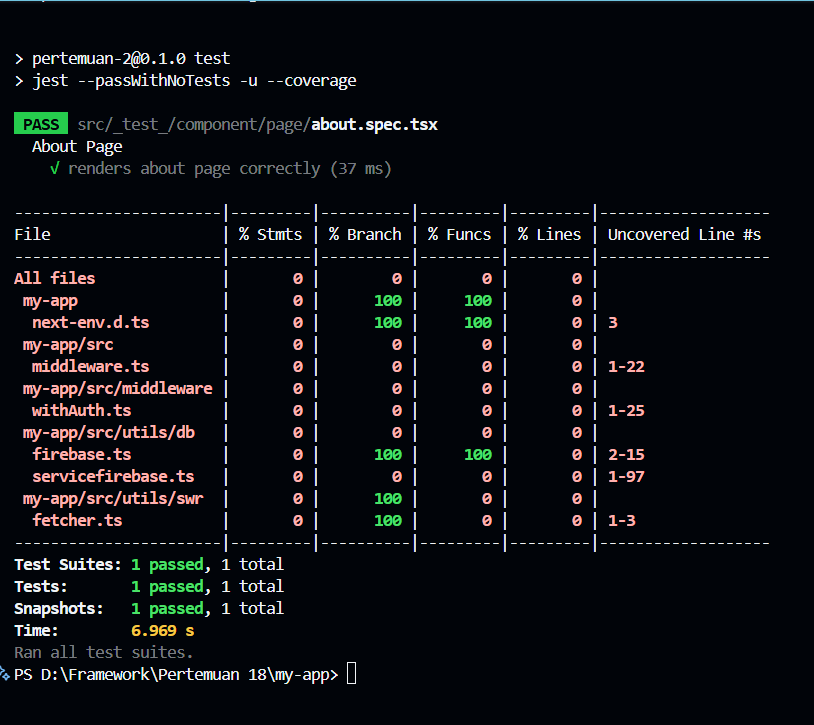

<li><h3>Coba Jika dibuat Salah: Rubah menjadi toBe("About")</h3></li>

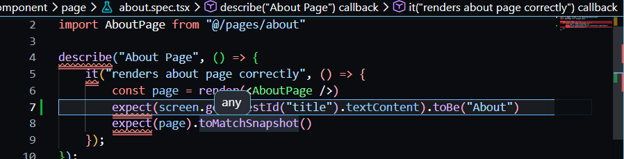

<li><h3>Jalan kan dan Hasil: FAIL Expected: "About",Received: "About Page"</h3></li>

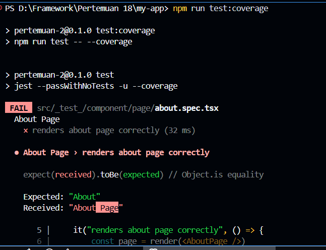

Praktikum 7 – Testing Page dengan Router (Mocking)
---
<h3>Kita coba untuk melakukan testing pada halaman produk </h3>
<li><h3>Buat file product.spec.tsx </h3></li>

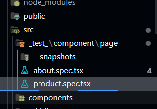

<li><h3>Tambahkan kode berikut</h3></li>

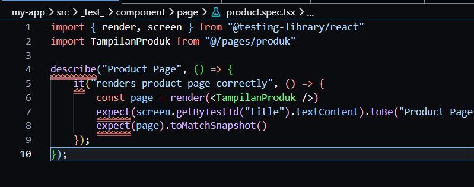

<li><h3>Ketika testing halaman Product, sering muncul error: NextRouter was not mounted </h3></li>

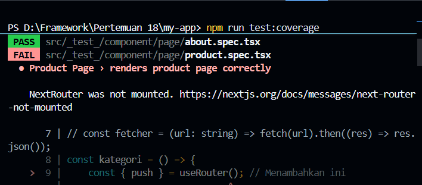

<li><h3>Solusi: Mock Next Router
Tambahkan di file product.spec.tsx</h3></li>

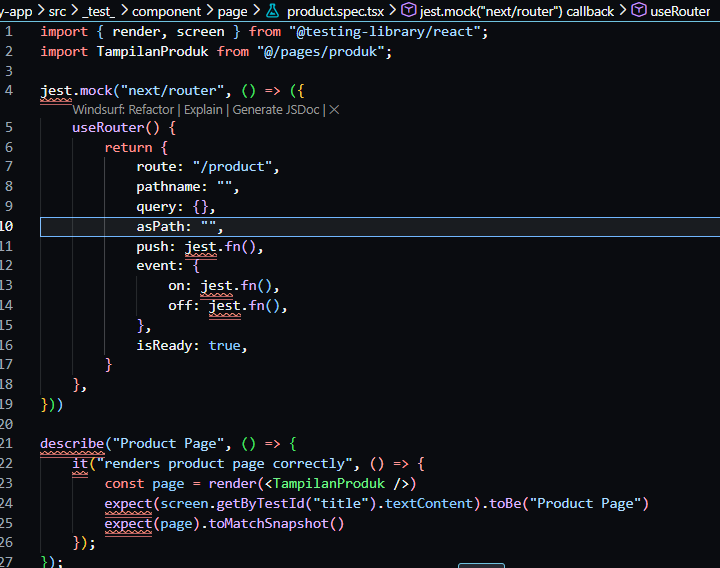

Praktikum 8 – Menangani Undefined Data
---
<li><h3>Jalankan npm run test:coverage maka akan muncul error </h3></li>

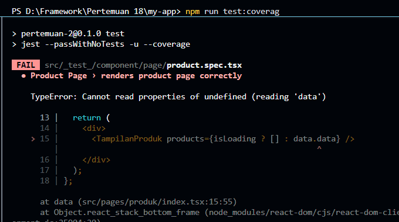

<li><h3>• Jika muncul error:
o Cannot read properties of undefined
o Perbaiki di komponen: Pada file index.tsx pada folder pages/produk</h3></li>

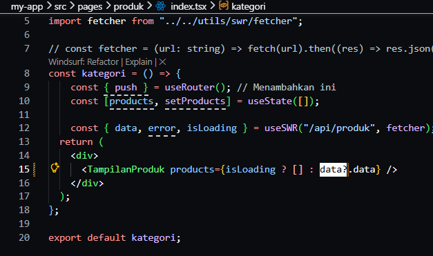

<li><h3>Jalankan npm run test:coverage maka akan muncul error </h3></li>

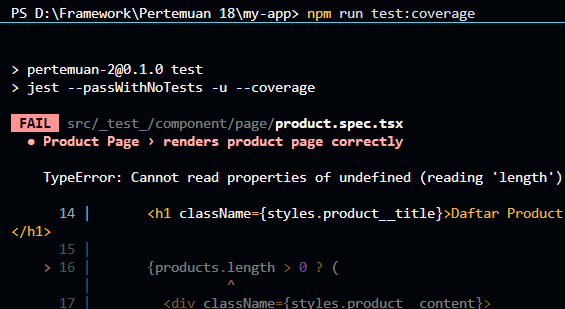

<li><h3>Maka Solusinya perbaiki code pada file</h3></li>

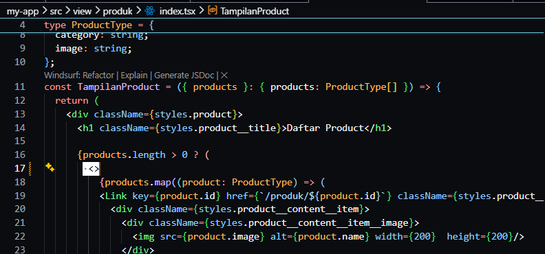
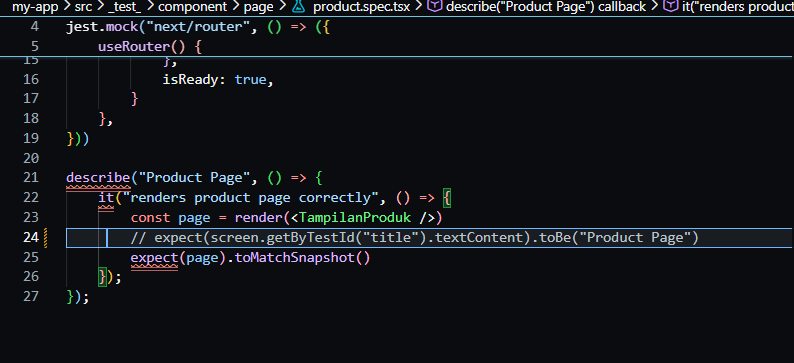

<li><h3>Analisis Coverage</h3></li>

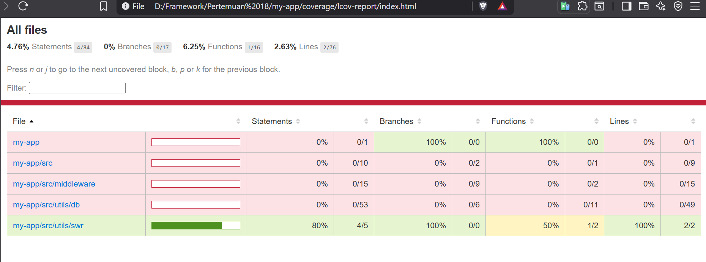

### Pertanyaan Individu

1. Mengapa unit testing penting sebelum production?

Jawaban : Untuk memastikan setiap fungsi berjalan benar, mencegah bug, dan menjaga kualitas kode sebelum digunakan user.

2. Mengapa branch coverage sulit mencapai 100%?

Jawaban : Karena harus menguji semua kemungkinan kondisi (if/else, edge case), termasuk skenario yang jarang atau sulit direplikasi.

3. Apa itu mocking?

Jawaban : Teknik untuk mengganti dependensi (API, database, dll) dengan versi tiruan agar testing fokus pada unit tertentu.

4. Kapan snapshot test digunakan?

Jawaban : Saat ingin memastikan tampilan UI tidak berubah secara tidak sengaja dari versi sebelumnya.

5. Apakah semua file harus dites?

Jawaban : Tidak. Fokus pada bagian penting seperti logic utama, fungsi kritis, dan komponen yang sering digunakan.