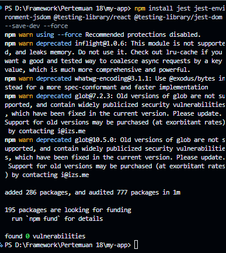
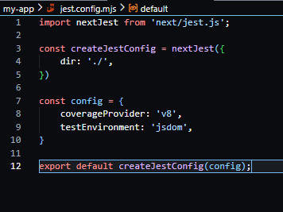
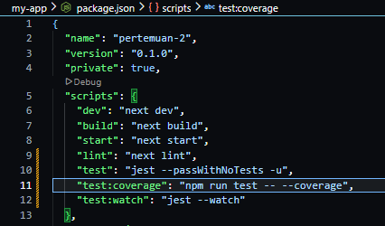
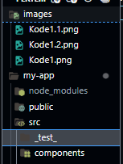
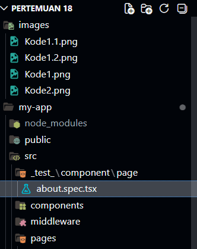
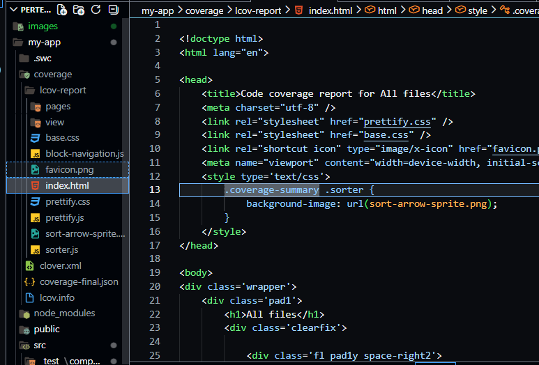

# Jobsheet 19 - Implementasi Unit Testing pada Next.js menggunakan Jest

###  Langkah Praktikum

Praktikum 1 - Setup Jest di Next.js
---

<li><h3>1. Install Dependencies</h3></li>

<li><h4>Jalankan : npm install jest jest-environment-jsdom @testing-library/react @testing-library/jest-dom --save-dev --force</h4></li>

<li><h3>2. Buat File Konfigurasi</h3></li>

<li><h4>Buat file:
o jest.config.mjs dan modifikasi </h4></li>

<li><h3>3. Tambahkan Script di package.json</h3></li>

Praktikum 2 - Struktur Folder Testing
---

<li><h3>Buat folder: src/_test_/</h3></li>

Praktikum 3 - Script Optimization
---

<li><h3>Menggunakan next/script </li> 
<li><h4>Buka file index.tsx pada folder layouts/Navbar dan modifikasi </h4></li>

Praktikum 4 - Optimasi Avatar dengan next/image
---

<li><h3>Buka file index.tsx pada folder layouts/navbar dan modifikasi :</h3></li>

<li><h3> Tambahkan hostname Google: </h3></li>

### Pertanyaan Individu

1. Mengapa  biasa tidak optimal?

Jawaban : Karena tidak ada optimasi otomatis (lazy loading, resize, format modern). Bisa bikin loading lambat dibanding komponen seperti next/image.

2. Apa perbedaan font CDN dan next/font?

Jawaban : CDN mengambil dari server luar sedangkan next/font berada di host lokal membuat lebih cepat & konsisten (tanpa request eksternal)

3. Mengapa script bisa membuat website lambat?

Jawaban : Karena script bisa memblokir rendering (blocking), menambah beban JavaScript, dan memperlambat waktu load halaman.

4. Kapan harus menggunakan dynamic import?

Jawaban : Saat komponen tidak perlu dimuat di awal (misalnya modal, chart, atau fitur berat) agar load awal lebih ringan.

5. Apa dampak bundle size terhadap UX?

Jawaban : Semakin besar bundle membuat loading semakin lebih lama dan membuat UX buruk (lambat, tidak responsif).