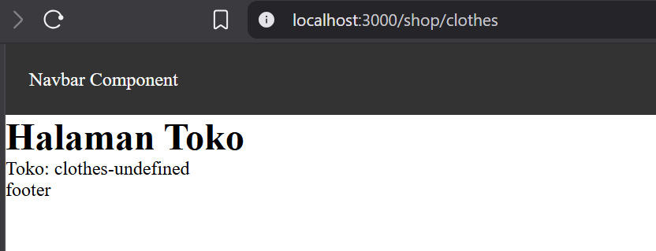
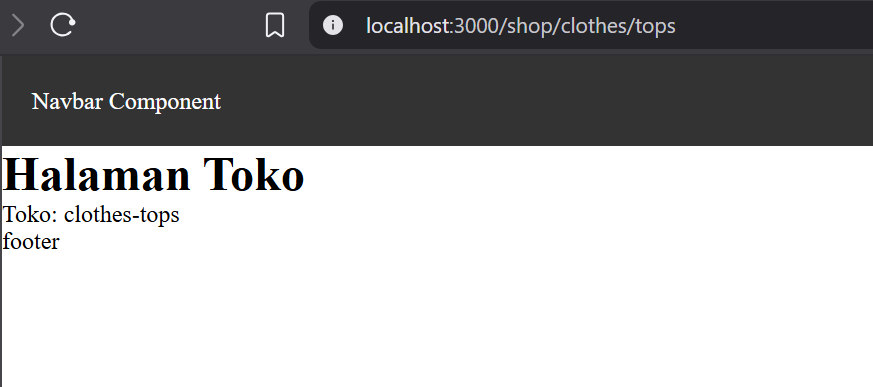
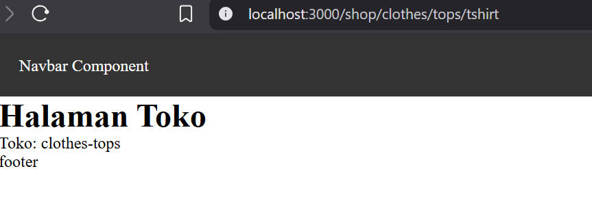

# Jobsheet 4 

###  Langkah Praktikum

Langkah 1 - Membuat Catch-All Route
---

Langkah 2 - Pengujian Catch-All Route
---

<li>/shop/clothes </li>

<li>/shop/clothes/tops </li>

<li> /shop/clothes/tops/t-shirt

Langkah 3 - Optional Catch-All Route
---

Langkah 4 - Validasi Parameter
---

Langkah 5 - Membuat Halaman Login & Register
---

Langkah 6 -  Navigasi Imperatif (router.push)
---

### Tugas Praktikum

Tugas 1 (Wajib)
---

1. Buat catch-all route: 
2. /category/[...slug].js 
3.  Tampilkan seluruh parameter URL dalam bentuk list.

Tugas 2 (Wajib)
---

1. Buat navigasi: 

o Login → Product (imperatif) 

o Login ↔ Register (Link)

Tugas 3 (Pengayaan)
---
1. Terapkan redirect otomatis ke login jika user belum login.

<h3> Hasil : </h3>

### Pertanyaan Refleksi 

1. Apa perbedaan [id].js dan [...slug].js?

Jawaban : [id].js digunakan untuk menangkap satu parameter saja, sedangkan [...slug].js digunakan untuk menangkan banyak URL

2. Mengapa slug berbentuk array?

Jawaban : Karena [...slug] bisa menerima lebih dari satu bagian URL, jadi disimpan dalam bentuk array

3. Kapan sebaiknya menggunakan Link dan router.push()? 

Jawaban : Link digunakan untuk perpindahan navigasi biasa seperti (klik menu/tombol), sedangkan router.push() digunakan untuk navigasi aksin tertentu contohnya (Login)

4. Mengapa navigasi Next.js tidak me-refresh halaman?

Jawaban : Karena Next.js menggunakan client-side navigation, jadi hanya konten yang berubah tanpa reload seluruh halaman