# Jobsheet 6 - Custom Document dan Custom Error Page pada Next.js

###  Langkah Praktikum

Langkah 1 - Membuat Custom Document
---
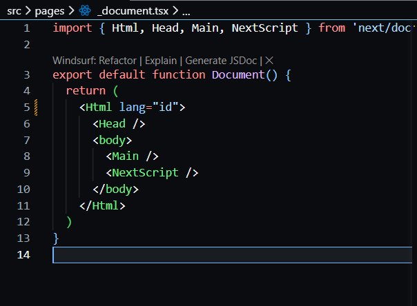

<li><h3> Hasil : </h3></li>

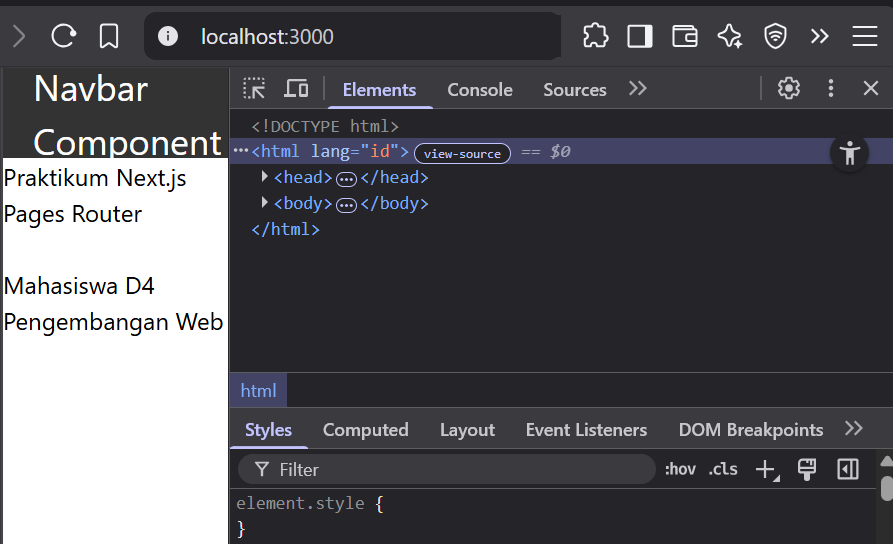

Langkah 2 - Pengaturan Title per Halaman
---
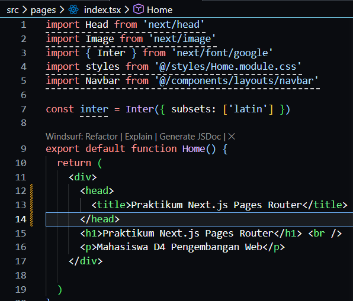

<li><h3> Hasil : </h3></li>

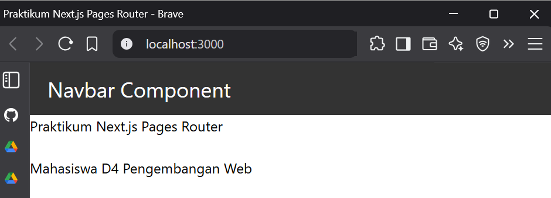

Langkah 3 -– Membuat Custom Error Page (404)
---
<li><h3>Membuat file 404.tsx </h3></li>

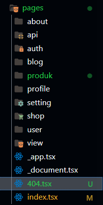

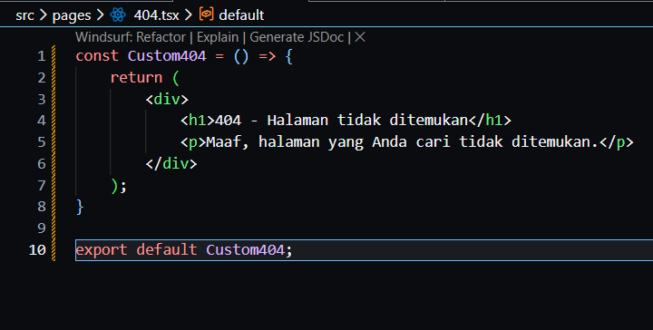

<li><h3> Hasil : </h3></li>

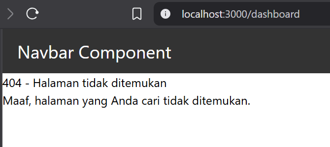

Langkah 4 - Styling Halaman 404
---

<li><h3> Buat file 404.module.scss di folder styles</li>

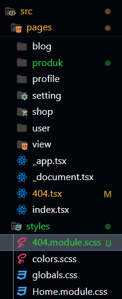

<li><h3> Buat kode 404.module.scss </li>

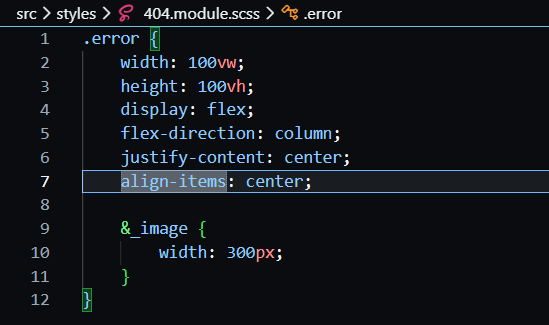

<li><h3> Modifikasi kode 404.tsx </li>

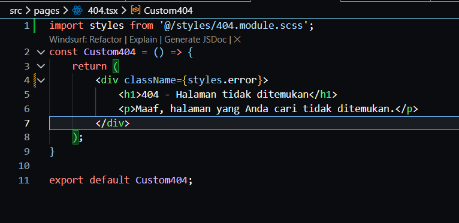

<h3> Hasil: </h3>

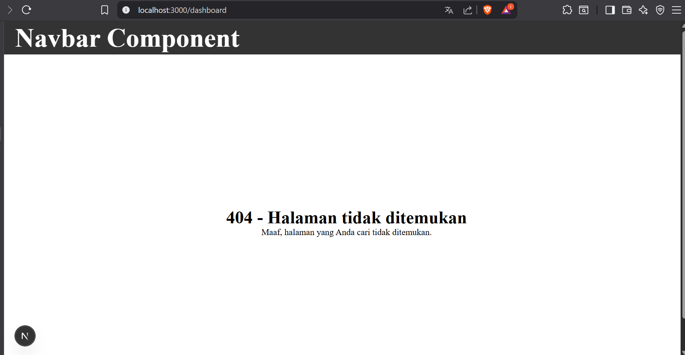

<li><h3> Menghilangkan Navbar </li>

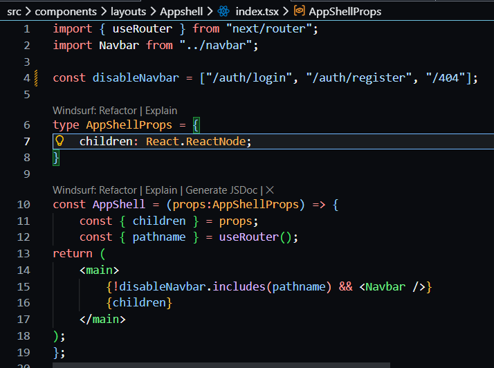

<h3> Hasil: </h3>

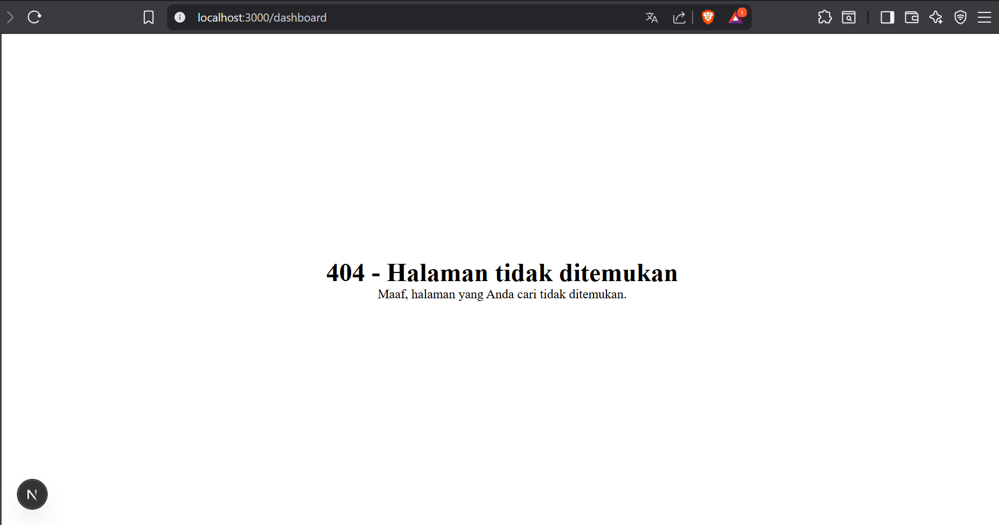

Langkah 5 - Menampilkan Gambar dari Folder Public
---

<li><h3> Modifikasi index.tsx pada Navbar </li>

<li><h3> Modifikasi global.css </li>

<li><h3> Modifikasi index.ts pada folder pages </li>

<li><h3> Modifikasi _app.tsx ( pastikan import styles dalam keadaan aktif) </li>

<H3> Hasil: </h3>

Langkah 6 - Membuat Layout Global (App Shell)
---

<li><h3> Modifikasi index.tsx pad AppShell </li>

Langkah 7 -  Implementasi Layout di _app.tsx
---

<h3> Hasil: </h3>

### Tugas Praktikum

Tugas 1
---

1. Buat halaman:

o /profile

o /profile/edit

2. Pastikan routing berjalan tanpa error
<h3> Hasil: </h3>

Tugas 2
---

1. Buat routing:
2. /blog/[slug]
3. Tampilkan nilai slug di halaman

Tugas 3 – Layout
---
1. Tambahkan Footer pada AppShell
2. Footer tampil di semua halaman

<h3> Hasil : </h3>

### Pertanyaan Refleksi 

1. Apa perbedaan routing berbasis file dan routing manual?

Jawaban : Routing berbasis file otomatis membuat rute berdasarkan struktur folder, sedangkan routing manual mengharuskan developer mendefinisikan rute secara eksplisit

2. Mengapa dynamic routing penting dalam aplikasi web?

Jawaban : karena memungkinkan satu template halaman menangani banyak data berbeda berdasarkan parameter URL

3. Apa keuntungan menggunakan layout global dibanding memanggil komponen satu per satu?

Jawaban : Karena struktur seperti header dan footer dapat digunakan ulang di semua halaman tanpa duplikasi kode.