# Jobsheet 7 - API Routes

###  Langkah Praktikum

Langkah 1 - Membuat API Produk
---

<li><h3> Buat file pad pages/api/produk.js</h3></li>

<li><h3> Buat kode statis</h3></li>

<li><h3> Hasil : </h3></li>

Langkah 2 - Fetch Data API di Frontend
---

<li><h3> Tambahkan useEffect() dan comment useEffect untuk isLogin pada pages/product/index.tsx </h3></li>

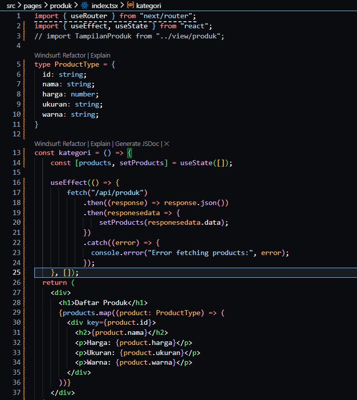

<li><h3> Hasil : </h3></li>

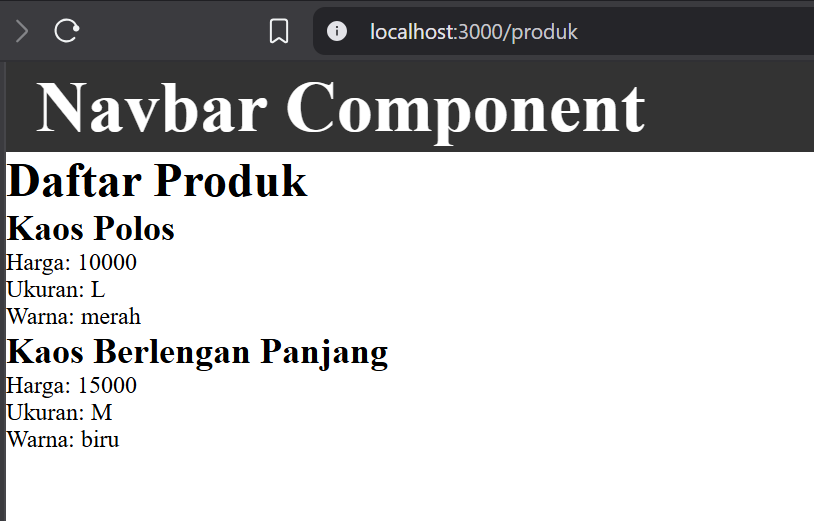

Langkah 3 - Setup Firebase
---
<li><h3>Buka Firebase Go To Console dan buat project </h3></li>

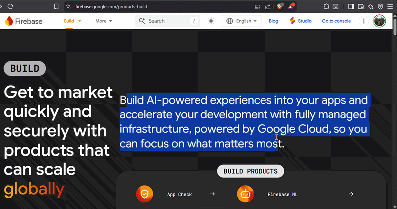

<li><h3>Buat project baru: Framework-next</h3></li>

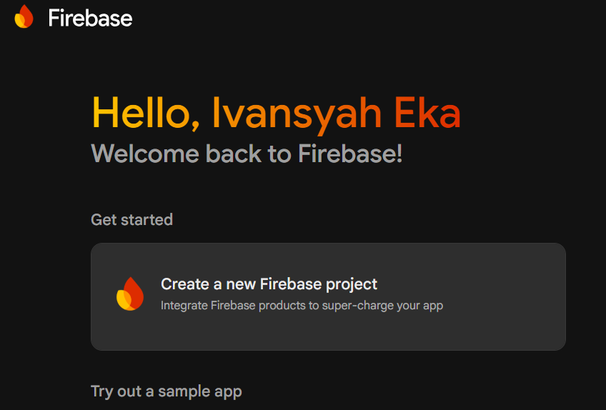

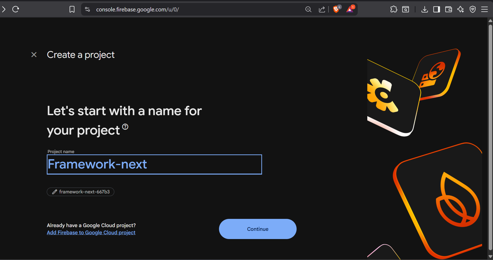

<li><h3> Hasil : </h3></li>

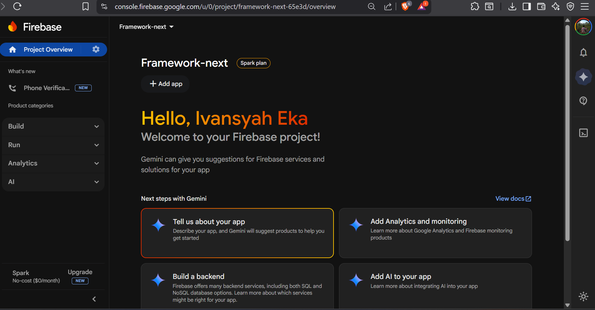

<li><h3> Klik add app dan pilih Web </li>

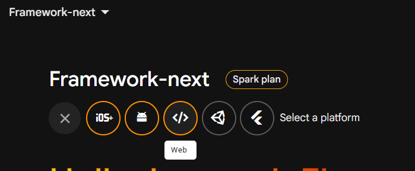

<li><h3> Klik register app </li>

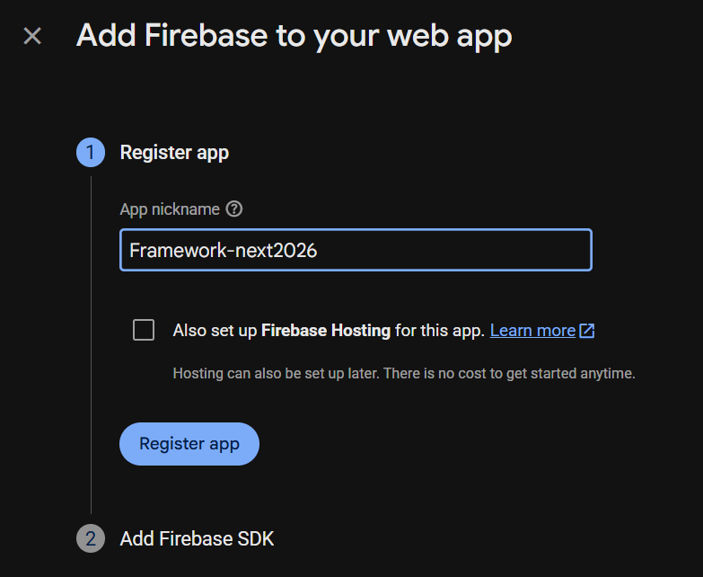

<li><h3> Klik continue to console </li>

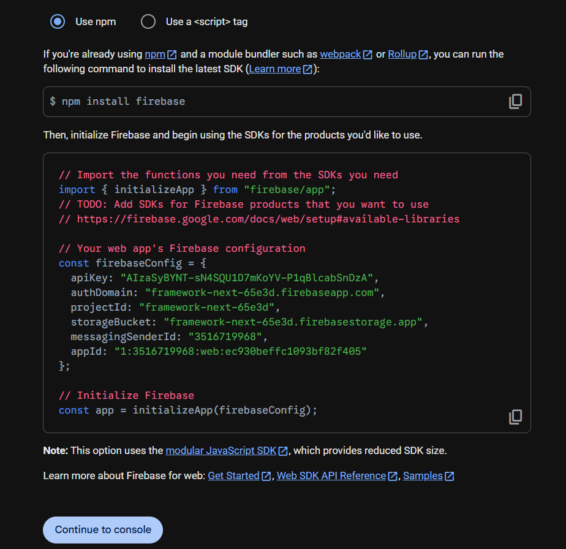

<li><h3> Aktifkan Firestore Database </li>

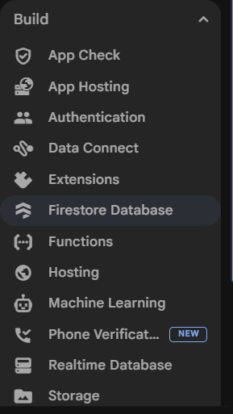

<li><h3> Create Database </li>

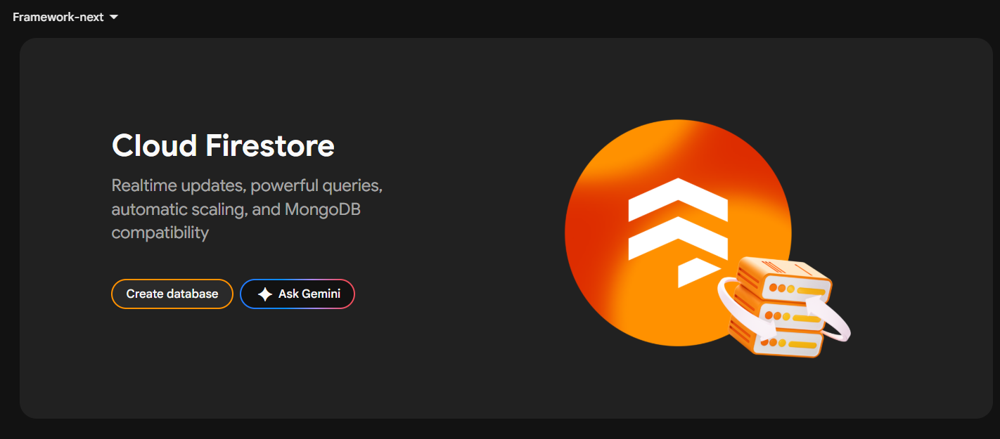

<li><h3> Pilih Location (Jakarta) </li>

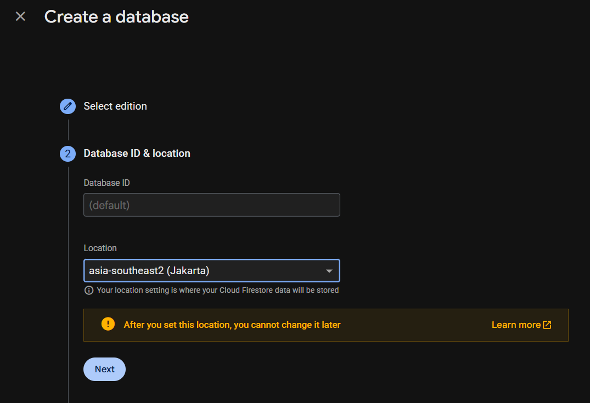

<li><h3> Dan klik Create </li>

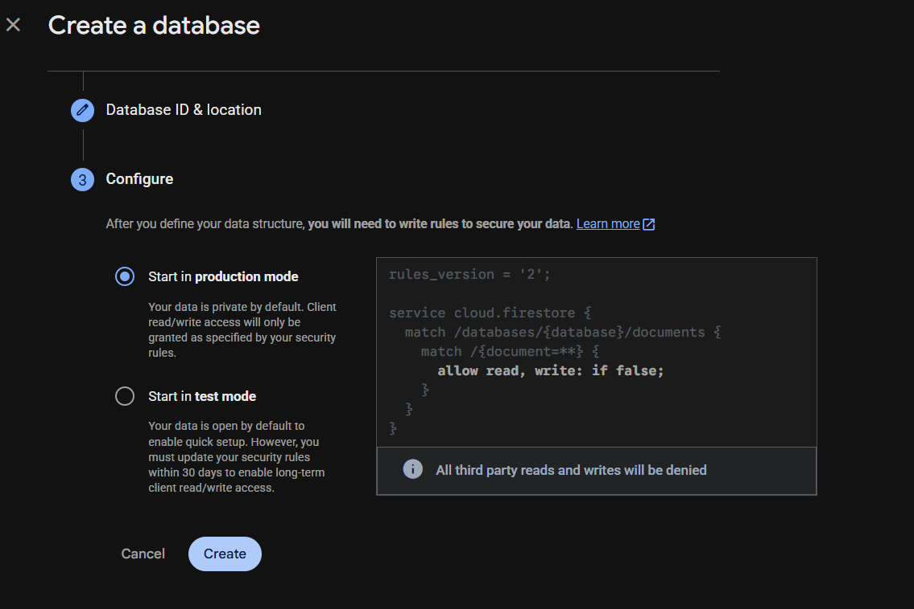

<li><h3> Hasil : </h3></li>

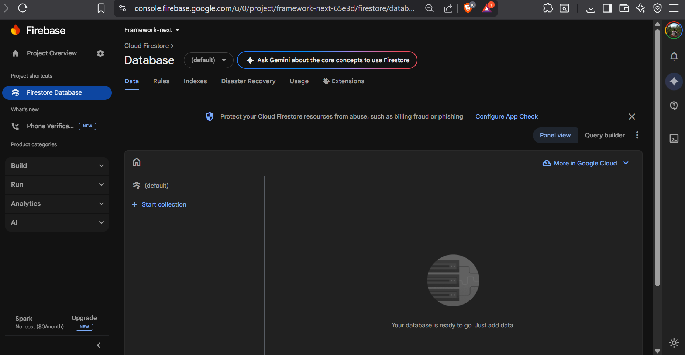

<li><h3> Ubah rulesnya menjadi true dan publish </h3></li>

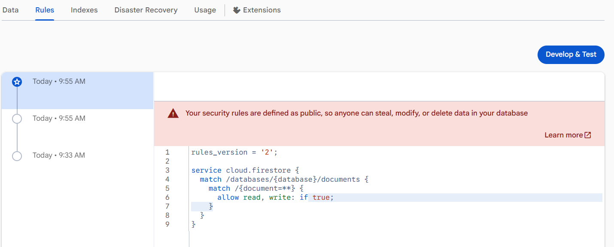

<li><h3> Buat collection (products) </h3></li>

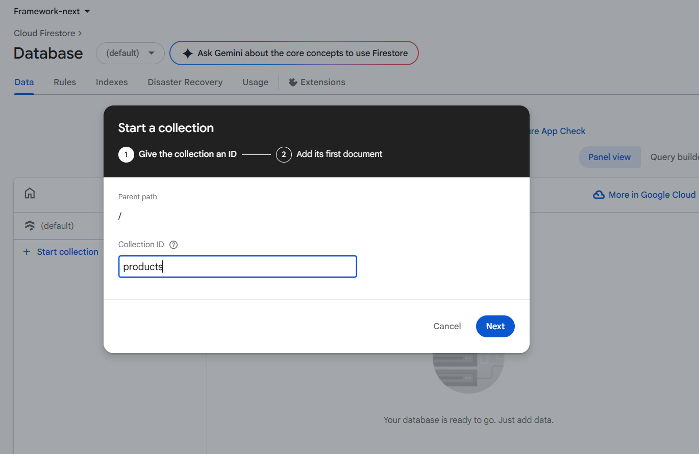

<li><h3> Gunakan auto-id dan tambahkan field </h3></li>

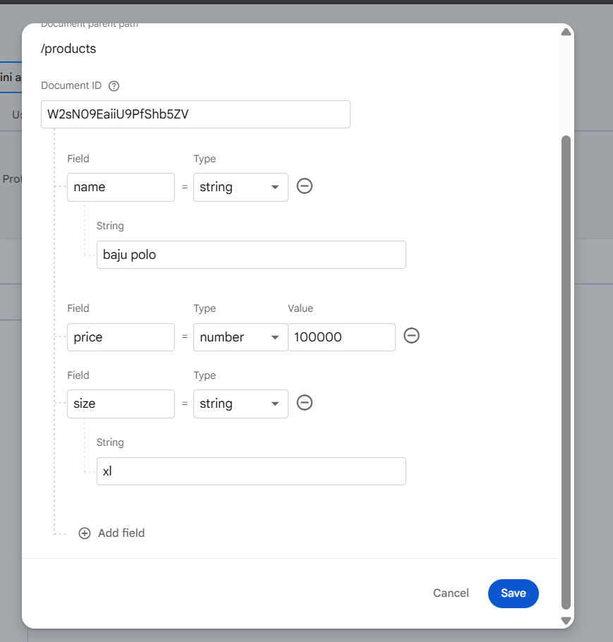

<li><h3> Hasil Akhir : </h3></li>

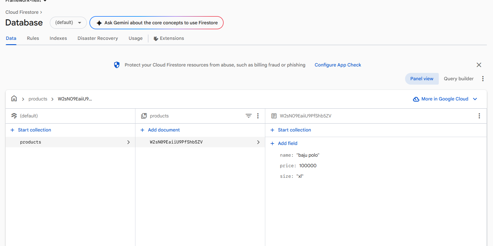

Langkah 4 - Styling Halaman 404
---

<li><h3> Buat file 404.module.scss di folder styles</li>

<li><h3> Buat kode 404.module.scss </li>

<li><h3> Modifikasi kode 404.tsx </li>

<h3> Hasil: </h3>

<li><h3> Menghilangkan Navbar </li>

<h3> Hasil: </h3>

Langkah 5 - Menampilkan Gambar dari Folder Public
---

<li><h3> Simpan gambar not-found.png ke folder public/ dan rename agar memudahkan </li>

<li><h3> Modifikasi kode pada 404.tsx: </li>

<h3> Hasil : </h3>

### Tugas Praktikum

<h3> Hasil : </h3>

### Pertanyaan Refleksi 

Pertanyaan Evaluasi
1. Apa fungsi utama _document.js?

Jawaban : Untuk mengatur dan memodifikasi struktur dasar dokumen HTML aplikasi secara global. File tersebut juga digunakan untuk mengatur elemen < html >, < head >, dan < body > yang membungkus seluruh halaman aplikasi.

2. Mengapa < title> tidak disarankan di _document.js?

Jawaban : Karena file tersebut bersifat global dan tidak mendukung perubahan dinamis untuk setiap halaman, jika < title > diletakkan disana maka semua halaman memiliki judul yang sama.

3. Apa perbedaan halaman biasa dan halaman 404.js?

Jawaban : Halaman biasa adalah halaman yang dibuat sesuai dengan sistem routing Next.js dan dapat diakses melalui URL tertentu, seperti /about atau /produk sedangkan halaman 404.js adalah halama khusus yang secara otomatis ditampilkan oleh Next.js ketika akses URL nya tidak tersedia.

4. Mengapa folder public tidak perlu di-import?

Jawaban : Karena folder public merupakan root path nya aplikasi sehingga kita tidak perlu mengimportnya melainkan dengan cara mengakses URL nya.