# Jobsheet 8 - Client Side Rendering & Data Fetching

###  Langkah Praktikum

Langkah 1 - Setup Data Produk
---

<li><h3> Menambah field yang berisi image address di Firebase </h3></li>

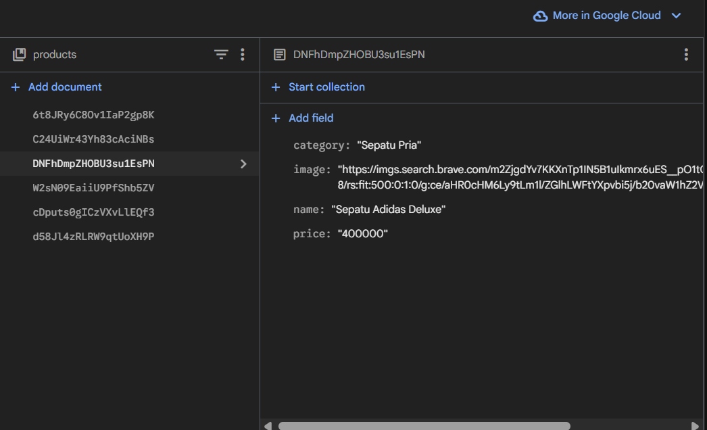

<li><h3> Hasil jalankan browser http://localhost:3000/api/produk : </h3></li>

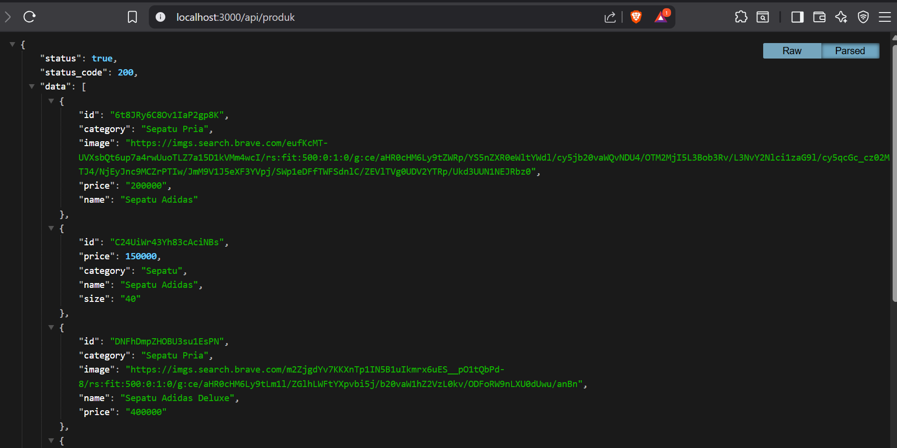

Langkah 2 - Implementasi CSR dengan useEffect
---

<li><h3> Buka file index.tsx pada folder views/products dan modfikasi kode index.tsx </h3></li>

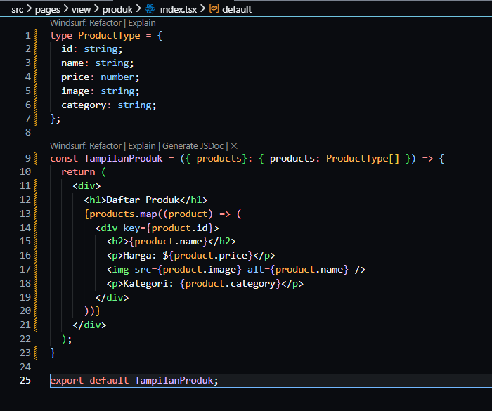

<li><h3> Modifikasi index.tsx pada pages/produk/ </h3></li>

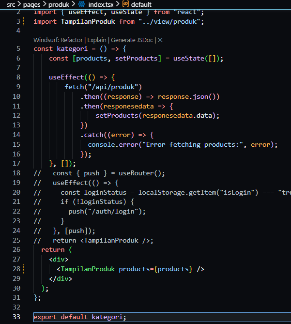

<li><h3> Hasil : </h3></li>

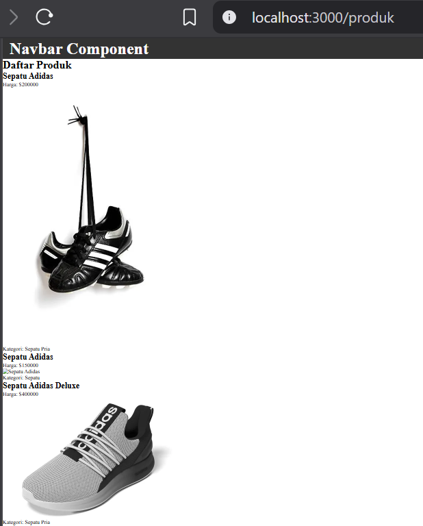

<li><h3>Modifikasi produk.modules.scss/</h3></li>

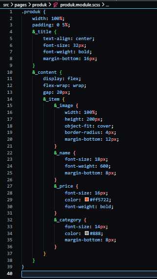

<li><h3>Modifikasi Pada file index.tsx pada folder pages/views/product</h3></li>

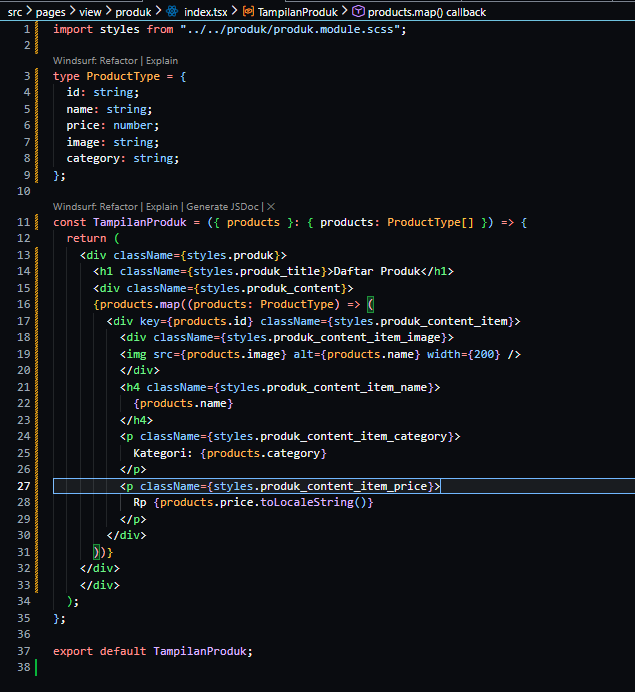

<li><h3> Hasil : </h3></li>

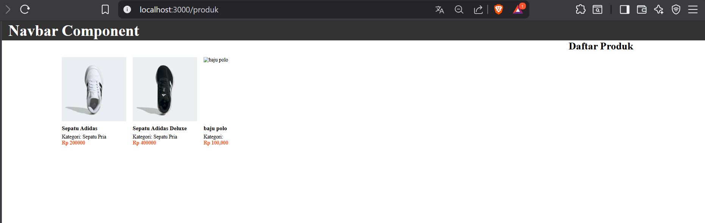

Langkah 3 - Implementasi Skeleton Loading
---

<li><h3> Modfikasi file index.tsx pada folder views/product/index.tsx </li>

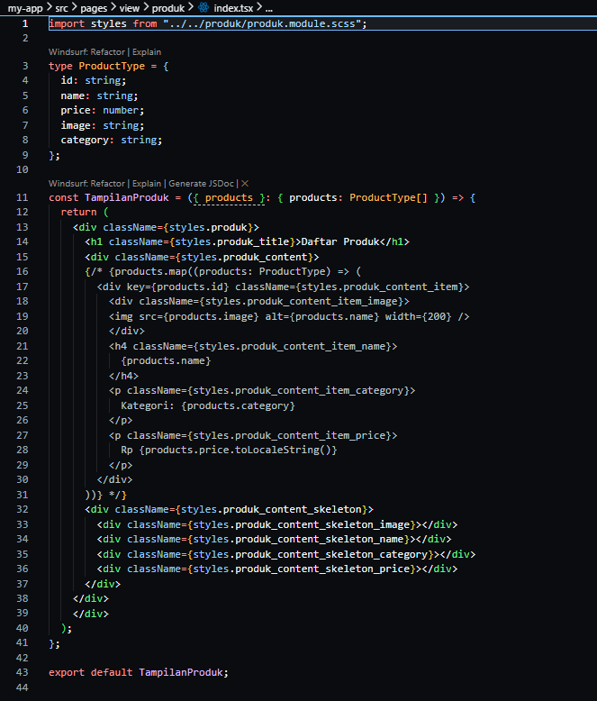

<li><h3> Modifikasi file product.module.scss </li>

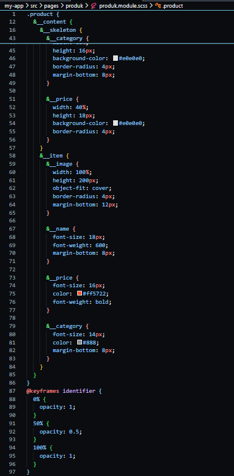

<li><h3> Hasil Jalankan browser maka akan muncul skeleton yang terdapat animasi berkedip : </h3></li>

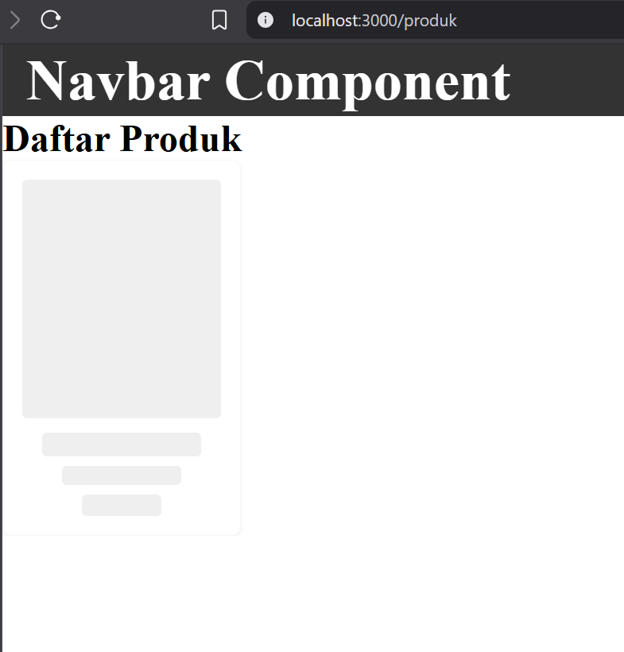

<li><h3> Modifikasi pada index.tsx pada folder views/product/index.tsx </li>

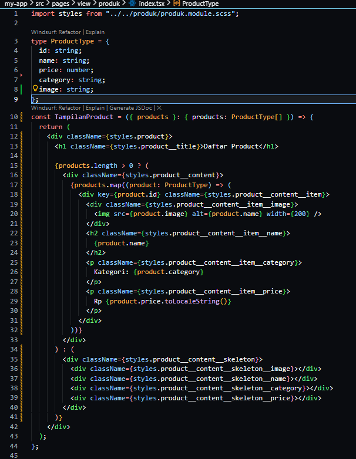

<li><h3> Hasil : </h3></li>

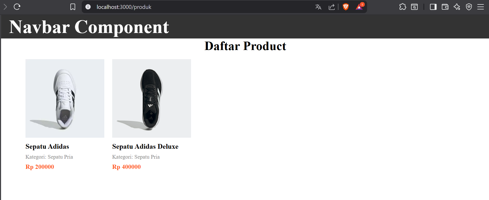

Langkah 4 - Implementasi SWR
---

<li><h3> Install SWR menggunakan perintah <i>npm install swr</i></li>

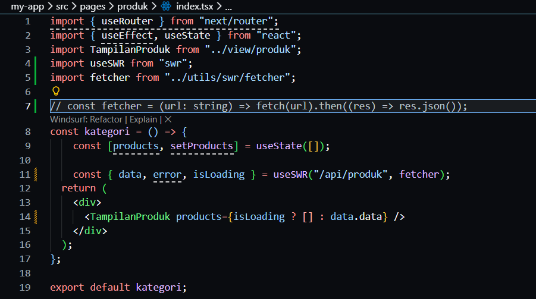

<li><h3> Buka dan modifkasi file index.tsx pada folder pages/product/ </li>

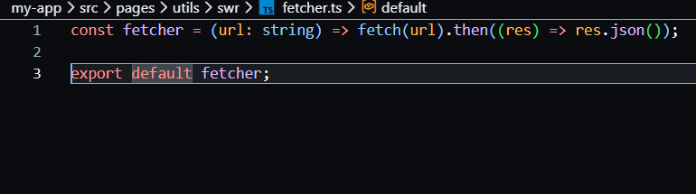

<li><h3> Buat folder swr pada utils dan tambahkan file dengan nama fetcher.js </li>

<li><h3> Modifikasi file fetcher.ts </li>

<li><h3> Modifikasi file index.tsx pada folder pages/produk </li>

### Tugas Praktikum

### Pertanyaan Refleksi 

Pertanyaan Evaluasi

1. Apa fungsi API Routes pada Next.js?

Jawaban : untuk membuat endpoint backend langsung di dalam proyek yang sama dengan frontend.

2. Mengapa .env.local tidak boleh di-push ke repository?

Jawaban : Karena biasanya berisi informasi yang sensitif seperti API Key, password database dan lain-lain.

3. Apa perbedaan data statis dan data dinamis?

Jawaban : Data statis adalah data yang tetap dan tidak dapat berubah selama aplikasi berjalan, sedangkan Data Dinamis adalah data yang dapat berubah-ubah dan biasanya diambil dari database, API, atau input pengguna saat aplikasi dijalankan.

4. Mengapa Next.js disebut framework fullstack?

Jawaban : Karena dapat menangani backend dan frontend dalam satu framework.