# Jobsheet 9 - Server Side Rendering (SSR)

###  Langkah Praktikum

Bagian 1 - Setup Halaman SSR
---

<li><h3> Buat file baru pada pages/products/server.tsx </h3></li>

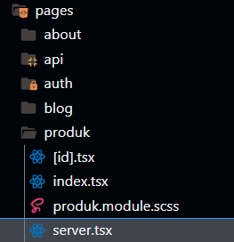

<li><h3> Modifikasi file server.tsx : </h3></li>

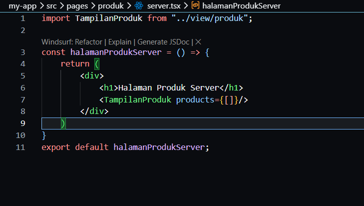

<li><h3> Jalankan browser : http://localhost:3000/produk/server </h3></li>

<li><h3> Hasil Bagian 1: </h3></li>

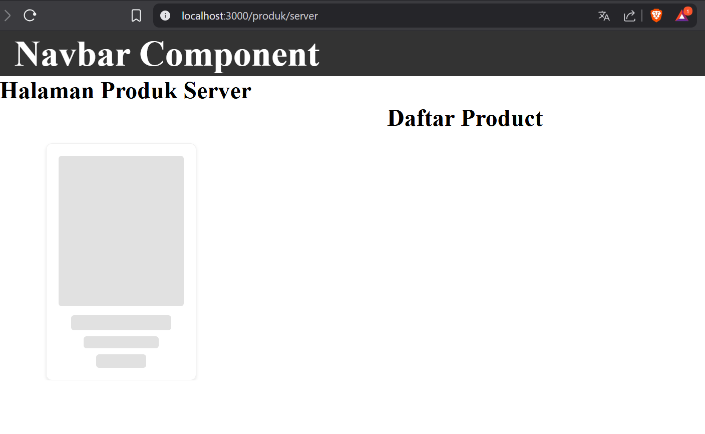

Bagian 2 - Implementasi getServerSideProps pada server.tsx
---

<li><h3> Menambahkan getServerSideProps() di pages/produk/server.tsx </h3></li>

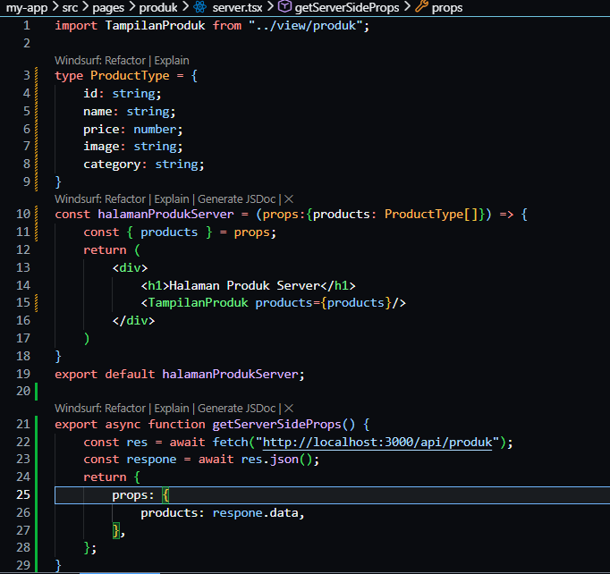

<li><h3> Hasil Bagian 2 : </h3></li>

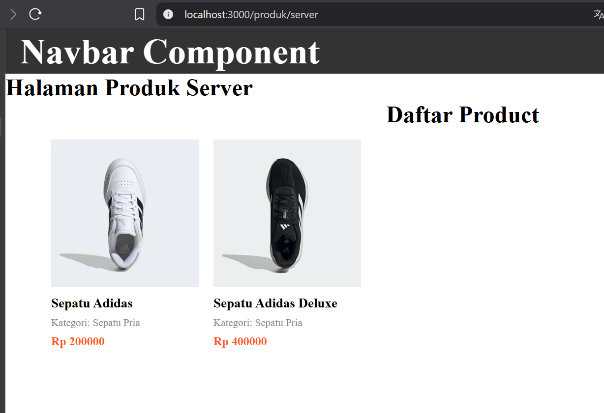

Bagian 3 - Refactor Type ( produk type )
---

<li><h3> Buat folder types pada folder pages dan buat file Product.type.ts </li>

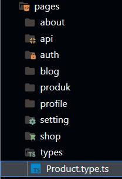

<li><h3> Modifikasi Product.type.ts </li>

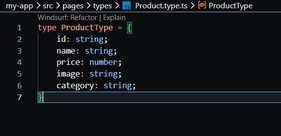

<li><h3> Modifikasikan juga pada file server.tsx </h3></li>

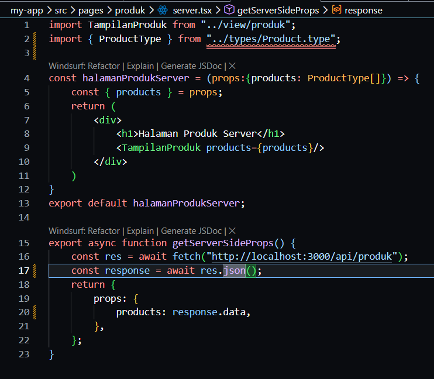

Bagian 4 - Uji Perbedaan CSR vs SSR
---

<li><h3> Uji 1 - Skeleton </h3></li>

  <li><h4> CSR </h4></li>

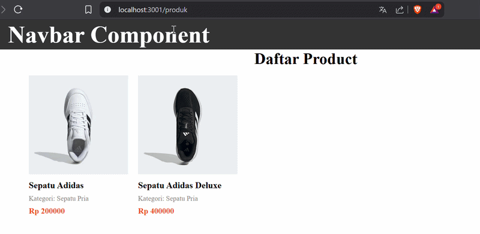

 <li><h4> SSR </h4></li>

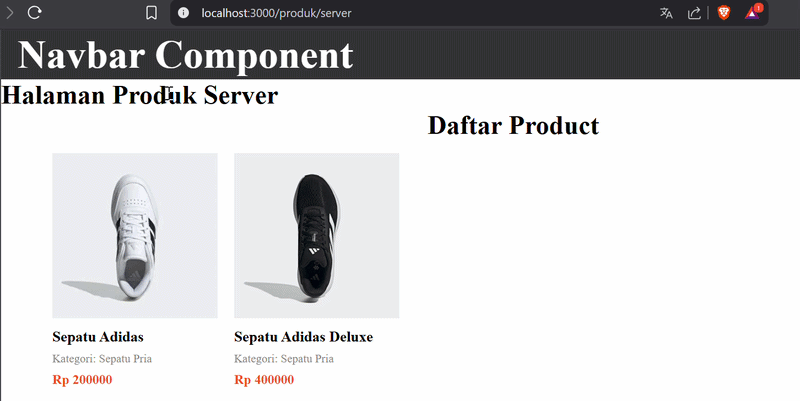

<li><h3> Uji 2 - Network Tab </li>

<li><h4> SSR </h4></li>

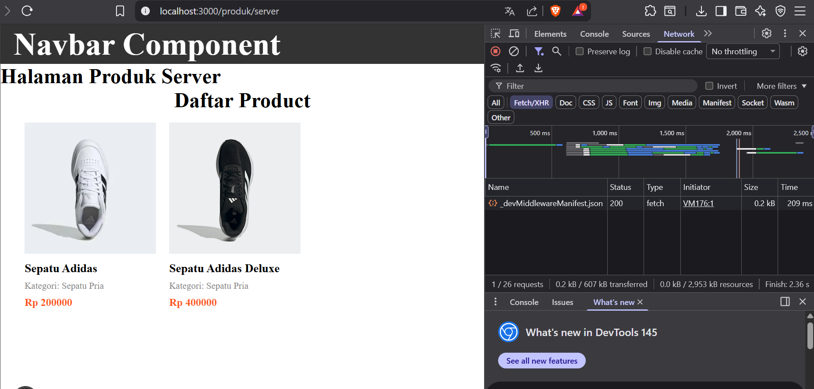

  <li><h4> CSR </h4></li>

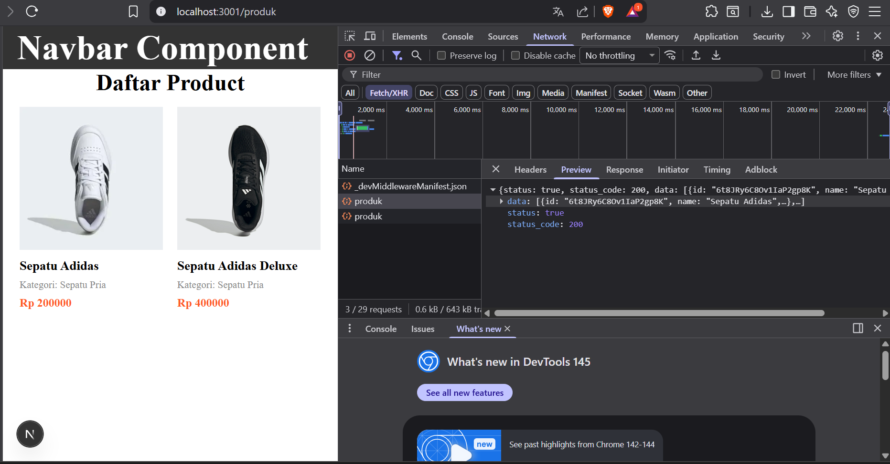

<li><h3> Uji 3 - Response HTML </li>

<li><h4> CSR </h4></li>

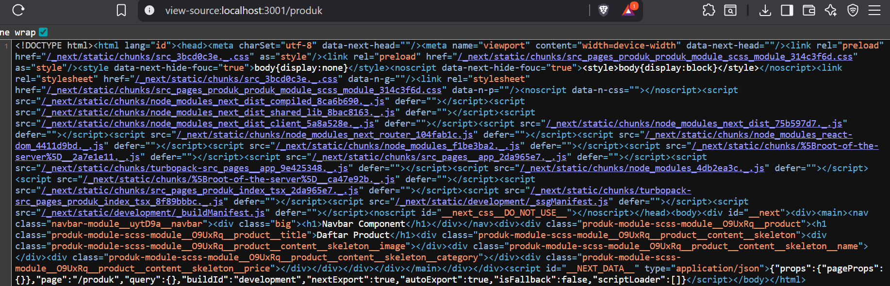

<li><h4> SSR </h4></li>

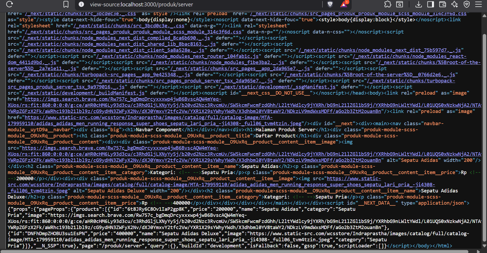

### Tugas Praktikum

