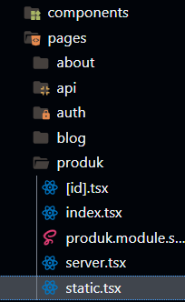
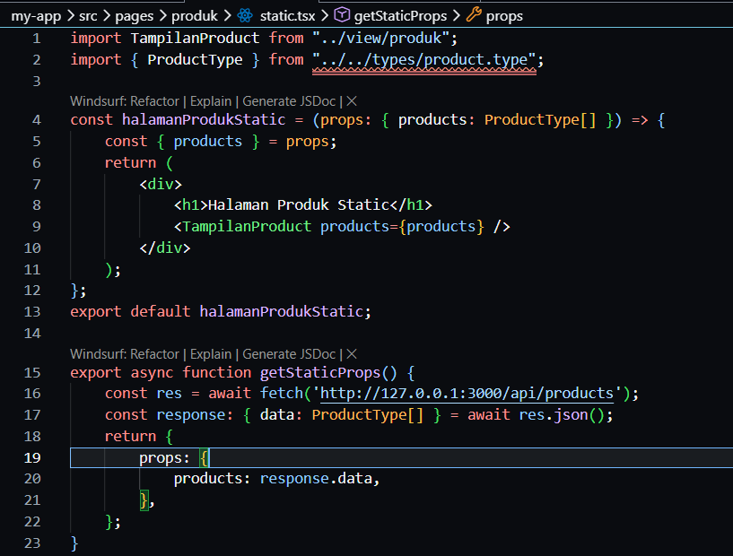
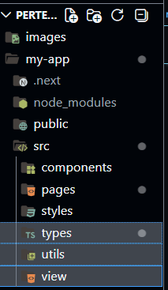
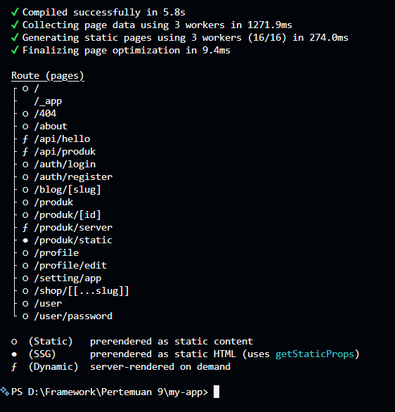
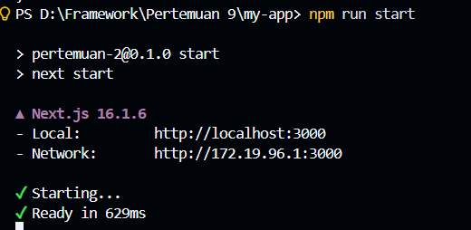
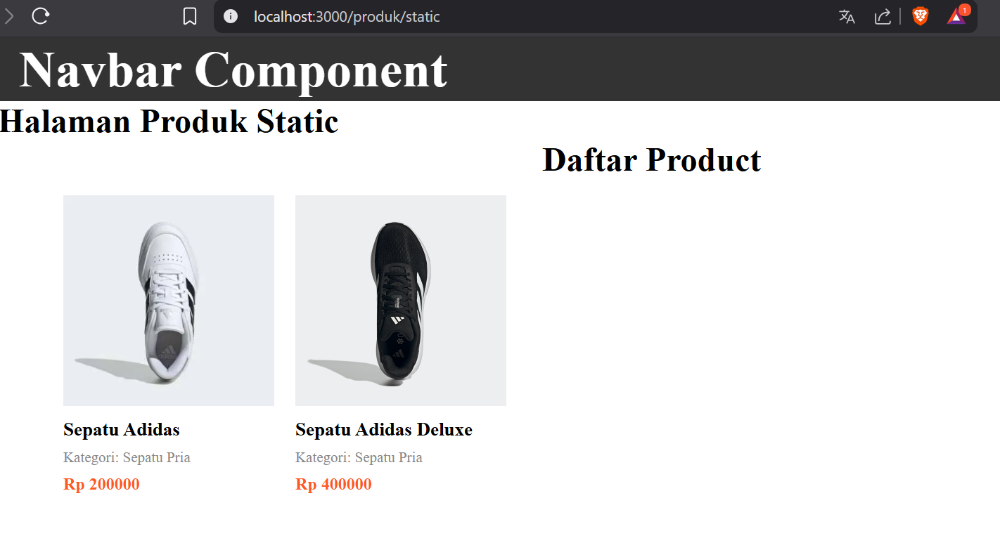
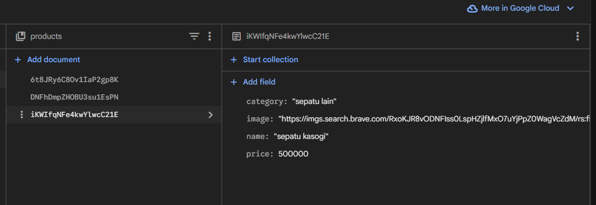
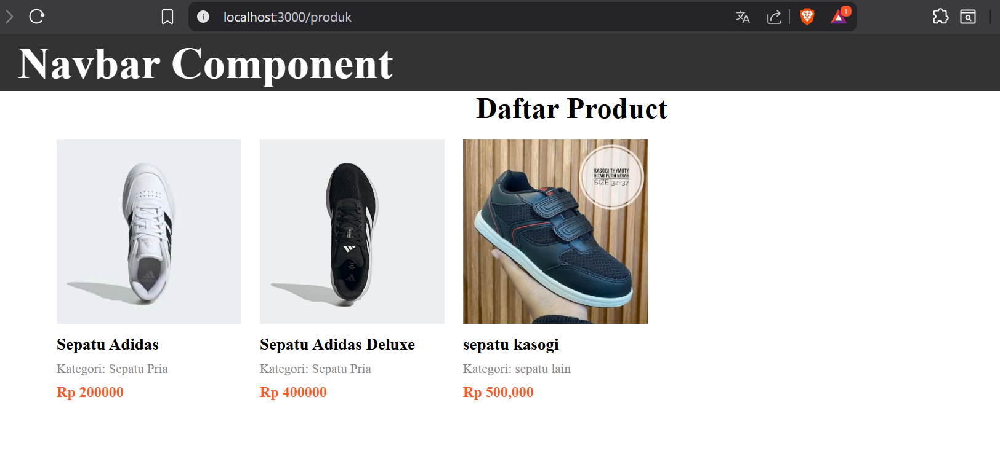
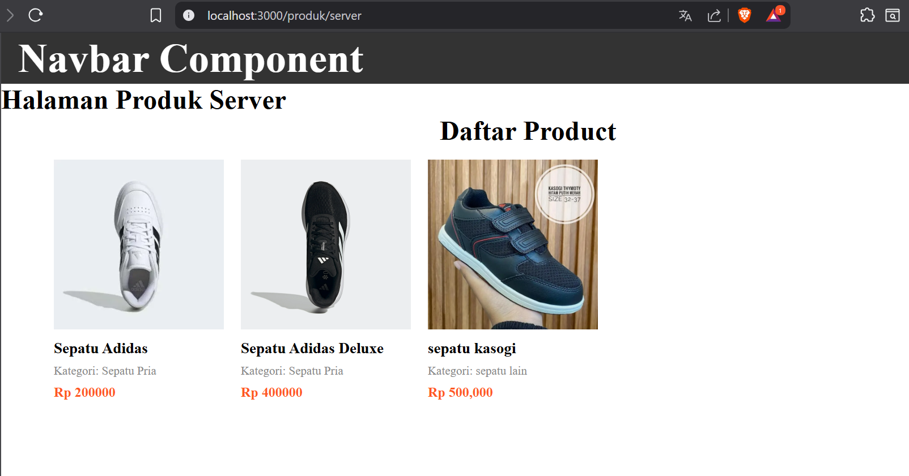
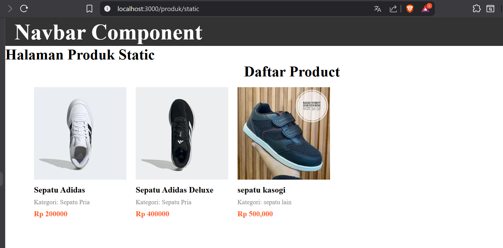

# Jobsheet 10 - Static Site Generation (SSG)

###  Langkah Praktikum

Bagian 1 - Setup Halaman Static
---

<li><h3> Buat file baru pada pages/products/static.tsx </h3></li>

<li><h3> Modifikasi file static.tsx : </h3></li>

Bagian 2 – Build Production Mode
---

<li><h3> Pindah beberapa folder diluar pages </h3></li>

<li><h3> Jalankan npm run build </h3></li>

<li><h3> Jalankan npm run start </h3></li>

<li><h3> Hasil Bagian 2 : </h3></li>

Bagian 3 – Pengujian Perubahan Data
---

<li><h3> Uji 1 - Tambah Data di Database </li>

<ol><h4> 1. Buka database firebasenya dan tambahkan data produk </ol>

<ol><h4> 2. Buka halaman:</ol>

<ul><h4> /products (CSR) → Data bertambah </ul>

<ul><h4> /products/server (SSR) → Data bertambah </ul>

<ul><h4> /products/static (SSG) → Data tidak berubah </ul>

<li><h3> Uji 2 - Build Ulang </li>

1. Jalankan kembali:
• npm run build
o lakukan secara bersamaan dengan npm run dev saat melakukan npm run
build
• npm run start
o npm run dev stop terlebih dahulu setelah itu npm run start

2. Refresh halaman static → Data baru muncul

### Tugas Praktikum

Analisis : Berdasarkan hasil pengujian yang dilakukan, dapat disimpulkan bahwa Client Side Rendering (CSR) menampilkan skeleton loading karena data diambil setelah halaman dimuat di browser. HTML awal yang dikirim server juga tidak berisi data produk.

Sedangkan pada Server Side Rendering (SSR), data sudah diproses di server sehingga HTML yang dikirim ke browser sudah lengkap. Hal ini menyebabkan halaman dapat langsung menampilkan data tanpa skeleton loading.

Dengan demikian, SSR lebih unggul dalam kecepatan tampilan awal dan SEO, sedangkan CSR lebih fleksibel untuk aplikasi yang membutuhkan interaksi tinggi di sisi client.

### Studi Analisis 
Jawab pertanyaan berikut:
1. Mengapa SSR lebih baik untuk SEO?

<i>Jawaban:</i> Karena HTML yang dikirim ke browser sudah berisi konten lengkap sehingga mesin pencari dapat langsung membaca dan mengindeks halaman.

2. Kapan sebaiknya menggunakan SSR?

<i>Jawaban:</i> Saat halaman membutuhkan data yang selalu terbaru dan ketika SEO penting, contohnya website berita atau e-commerce

3. Apa kekurangan SSR dibanding CSR?

<i>Jawaban:</i> Beban server lebih besar karena server harus merender halamana setiap ada permintaan pengguna

4. Mengapa skeleton tidak muncul pada SSR?

<i>Jawaban:</i> Karena data sudah diproses di server sehingga halaman langsung menampilkan data tanpa proses loading di browser